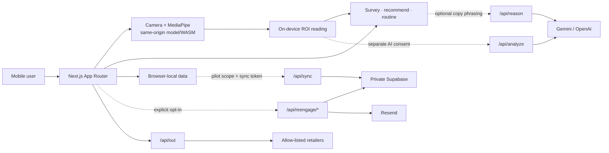

# ARU

**A 30-second, on-device skin scan that honestly picks your K-beauty routine.**

ARU is a mobile-first web app. It combines an optional on-device camera reading
with a short questionnaire, then proposes up to three K-beauty product
candidates and a morning/evening routine that fit the user's preferences,
budget and context — no account required.

The camera result describes cosmetic tendencies visible in the current photo.
It is **not** a medical diagnosis, treatment, or condition monitor. The whole
recommendation flow can also be completed with the questionnaire alone.

- **Live:** <https://aru-beauty.vercel.app>
- **Demo video (3 min):** <https://youtu.be/oc-ccLo-yn0>
- **OpenAI Build Week (Apps for Your Life):** [submission pack](docs/buildweek/SUBMISSION.md) · [build log](BUILDLOG.md) · [user research](docs/buildweek/user-research.md) · demo scripts ([EN](docs/buildweek/DEMO-SCRIPT.md) / [KO](docs/buildweek/DEMO-SCRIPT-KO.md))
- **한국어 문서:** [README.ko.md](README.ko.md) (full Korean documentation)
- Product contract and KPIs: [docs/PRD.md](docs/PRD.md)
- Current verified state: [docs/STATUS.md](docs/STATUS.md)
- System architecture: [docs/architecture.md](docs/architecture.md)
- Release procedure: [docs/production-release-checklist.md](docs/production-release-checklist.md)
- Continuous improvement loop: [docs/AUTOPILOT.md](docs/AUTOPILOT.md) (cycle protocol, guardrails, backlog)
  — closed history is split out into [docs/autopilot-changelog.md](docs/autopilot-changelog.md)
- Tone / ITA, checked against outside references: [docs/tone-ita-verification.md](docs/tone-ita-verification.md)
  (what `toneIta` is worth, and what it is not — it is the only tone stratifier the
  fairness gate uses)
- What ITA reads when b\* is near zero: [docs/ita-guard-decision.md](docs/ita-guard-decision.md)
  (three implementations guarded the singularity in two places and the ±90 fallback
  ignored the sign of b\*; the guard is now `b* == 0` in all three)
- Capture-resolution invariance of the ROI indices:
  [docs/capture-resolution-invariance.md](docs/capture-resolution-invariance.md)
  (`blemishDensity` was resolution-dependent; the blemish *count* still is)
- What a scan costs and where the time goes:
  [docs/scan-cost-measurement.md](docs/scan-cost-measurement.md)
  (`detectBlemishes` is 79-87% of it; measured on the build container, which is not a
  phone, and the document says so at length)
- `rgbToLab` across the language boundary, and what the `a*` fast path actually buys:
  [docs/rgb-to-lab-parity.md](docs/rgb-to-lab-parity.md)
  (the two languages agree bit for bit on 63-80% of 268,877 inputs and differ by at most
  1.47 units of `channelScale * 2^-52`, which is where the parity table's first
  tolerance comes from; the sRGB transfer curve, not the rest of Lab, is 37-61% of
  `detectBlemishes`)
- How far `a*` can move before `blemishCount` does, and what that rules out:
  [docs/blemish-perturbation-tolerance.md](docs/blemish-perturbation-tolerance.md)
  (below 1.046e-5 a\* units nothing can change the count; a 256-entry lookup table for
  the transfer curve is off by 0.470 and moves it from 6 to 7, so the curve stays. §7:
  the margin each count is actually decided by — 1.2e6 to 3.2e8 times the detector's own
  rounding error on a realistic frame, and exactly zero on a noiseless one)
- Why `/checkin`'s answer controls are 44px both ways, measured in a browser at 360px:
  [docs/checkin-tap-target-measurement.md](docs/checkin-tap-target-measurement.md)
  (32 of 45 controls were under the contract in five locales; every pill was 35.5px high)
- Why a run that pools two generations of the feature extractor warns instead of blocking:
  [docs/feature-generation-pooling.md](docs/feature-generation-pooling.md)
  (scikit-learn warns on a provenance mismatch and raises on a structural one, read from
  its own source; `coverage_warnings` names and counts the pooled generations, and the
  published promotion rule is untouched)
- What a card shared from `/studio` should link back to, and why no cycle picked:
  [docs/share-return-path-decision.md](docs/share-return-path-decision.md)
  (five options with what each costs; `shareUrl` is still unused because `/studio` holds
  edited copy rather than the levels `moodShareUrl` needs — an owner decision)
- Server-side funnel telemetry:
  [docs/funnel-flush-design.md](docs/funnel-flush-design.md)
  (the flush path exists and is off — `NEXT_PUBLIC_FUNNEL_FLUSH`; §8 is the ingest
  endpoint and its attacker table; read §5 before
  setting it, because a browser cannot hold the sync token)

## Current release state

This table separates finished code from external owner work. The single source
of truth for the latest detail is [STATUS](docs/STATUS.md).

| Area | Current state | Verified evidence | Next gate |
|---|---|---|---|
| Consumer Web | Product-polish production deploy + canary complete | PR #55, merge `024784c`, deployment `dpl_FCKydr4QKpM5Zh28aGrkxev6Ad8U`, full smoke and post-deploy mobile/API canary | Repeat the same gate on any code or env change |
| Security & data boundary | Production verified | RLS on 9 app tables, direct `anon`/`authenticated` privileges revoked, private crop bucket, CSP, Firewall, runtime secret validation | Re-verify on any schema or secret change |
| Mobile UI/UX | Copy regression green across locales and viewports | 9 core routes × 5 locales × 4 viewports — a 180-combination text-fit matrix plus 320px manual browser QA | Extend the same matrix for new screens or translations |
| Android camera | Galaxy S25 Edge basic flow PASS | Permission, front-camera mirroring, quality gate, capture, retake | Lighting/reflection/occlusion/background-resume plus the iPhone Safari matrix |
| iPhone Safari camera | Production WebKit lifecycle PASS, physical device PENDING | PR #60, merge `ece4617`, deployment `dpl_EZK8pi9EHAC75bZ2YwFKCBRZtLY9`; 5 lifecycle regressions (background, `mute`, `ended`, `pagehide`, explicit resume) green on public production | Permission/lens/rotation/capture matrix on current and previous iOS Safari hardware |
| Email | Code and policy complete | Explicit opt-in, signed expiring unsubscribe, withdrawal exclusion, retention-cleanup tests | Real delivery, unsubscribe and cron verification on a verified domain |
| Android TWA | API 36 signed AAB verified | Package, permissions, signing, lint `No issues found`, Gradle clean bundle, Digital Asset Links | Internal-track physical-device QA after the Play distribution certificate lands |
| Google Play | Submission pack ready, Console blocked | ko/en listings, Data safety, content rating, reviewer docs, real UI assets | Developer identity, payment account, support email, App Signing, tester track |

> A finished Web production deploy does not mean a finished Google Play launch.
> Identity, payment, distribution-certificate and test-track evidence exists
> only in the Play Console and is never guessed from this repository.

## The problem this product solves

K-beauty buyers struggle to narrow candidates quickly because of the sheer
number of products and the exaggerated language around them. ARU reduces that
problem with these principles:

- Start immediately on mobile, with no account creation.
- The camera is optional; a failure or a denial always continues into the
  questionnaire flow.
- Prioritise the quality of the T-zone and cheek skin ROIs over "is a face
  visible" checks.
- Cap recommendations at three candidates, each with its selection rationale
  and a morning/evening routine.
- Record "opened a retailer" and "actually started using" as different events.
- Never display unverified prices, stock, star ratings, review counts or
  affiliate badges.
- Block diagnosis/treatment/improvement-guarantee language; describe only
  "tendencies visible in the current photo" and questionnaire answers.

### Out of scope

- Diagnosing, treating, prescribing for, or monitoring skin conditions
- Definitive skin typing or quantitative clinical scores from a photo alone
- Funnel interpretations that appear to prove purchases or efficacy
- Uploading face/skin images or retaining training data without consent
- Commerce that directly handles accounts, payment, orders or delivery
- Unverified real-time price/stock/review aggregation

## Core user flows

### 1. Camera journey

`Home → scan permission / optional consent → skin-ROI quality gate → auto or
manual capture → review/retake → survey → report → retailers · care · share →
optional usage start / check-in`

1. Entering `/scan`, the user first confirms the camera's purpose and the
   storage/transmission choices.
2. Face landmarks from the front camera align the T-zone and both cheek ROIs.
3. Continuous quality ticks grade face size, centering, frontal angle,
   brightness, steadiness and skin-ROI state.
4. Auto-capture starts its countdown only after two consecutive passing ticks
   and cancels if conditions drift.
5. Right after capture the frame is re-validated at original resolution, and
   two extra frames are analysed to reduce transient noise.
6. On insufficient quality, the app shows the reason and how to adjust, and
   offers a retake or questionnaire-only continuation.
7. On iPhone Safari, if a tab switch or camera-track interruption occurs, the
   existing stream is released and a recovery screen lets the user explicitly
   turn the camera back on.
8. AI cross-checking and training crops each run only under their own separate,
   explicit consent.

### 2. Questionnaire-only journey

`Home → survey → report → retailers · care · share → optional usage start /
check-in`

- Camera denial, an unsupported browser, model-loading failure, low light, or
  the user's own choice all land on the same questionnaire fallback.
- With no camera result, the report uses questionnaire answers only and never
  fabricates scan evidence.
- Without an AI provider key — or if the provider fails — the flow completes
  with local recommendations and template copy.

### 3. Research / pilot journey

`Internal pilot session → participant/session match check → per-purpose consent
→ capture & feedback → local review/export → authenticated server sync →
offline evaluation`

- `/pilot`, `/ops` and `/eval` return 404 in production by default.
- Pilot scope requires an exact match of both participant and session.
- There is no fallback that treats ordinary user consent as pilot consent.
- Model promotion is never automated; a human reviews the defined data and
  fairness gates.

### 4. Reminder journey

`Explicit email subscription → 2-week / 4-week cron → check-in → signed
unsubscribe → cleanup 30 days after unsubscribe or the 4-week send`

- Email is stored only when a user who started a recommendation separately
  opts in.
- Unsubscribe tokens are signature- and expiry-checked.
- Withdrawn contacts are excluded from subsequent sends.
- Code tests and real Resend delivery verification are separate release gates.

## Screen and route map

| Route | Role | Failure / protection behaviour |
|---|---|---|
| `/` | Product intro, language switcher, camera/survey entry | Core CTAs keep 44px touch targets at 360px |
| `/scan` | Camera quality gate, capture, on-device analysis | Permission/model/quality failure → retry or `/survey` |
| `/survey` | Skin concerns, preferences, budget, exclusions | View and completion events recorded separately per session |
| `/report` | Up to 3 candidates, selection reasons, trust notes | Verified local templates on AI failure |
| `/care` | Morning/evening routine, usage start, retailers | Retailer clicks separated from usage start |
| `/reco` | Candidate comparison and follow-up exploration | No unverified price/stock/review display |
| `/studio` | Share-card editing, Web Share | Safely prefilled when a real scan result exists |
| `/checkin` | 2- and 4-week post-usage check-in | Safe guidance when no local/subscription state exists; answer pills keep 44px touch targets in all five locales |
| `/privacy` | Data purpose, transmission, retention, deletion | Used as the public production URL |
| `/unsubscribe` | Signed email unsubscribe | Rejects missing/tampered/expired tokens |
| `/pilot`, `/ops`, `/eval` | Research participation, ops, evaluation | 404 in production unless explicitly enabled |

Screenshots: [`docs/buildweek/assets`](docs/buildweek/assets) (English,
1080×2160).

## System architecture



The default camera reading and recommendation run in the browser. Server APIs
exist only for AI cross-checking, authenticated pilot sync, email operations
and allow-listed retailer redirects. See
[Architecture](docs/architecture.md) for detailed data flow and the ML
promotion structure.

## Camera and skin-ROI pipeline

ARU prioritises "is the skin region good enough to analyse" over "is a face
visible".

1. `getUserMedia` requests the 1080×1440 front camera first, retrying with a
   720×960 profile on failure.
2. MediaPipe FaceLandmarker runs in VIDEO mode on a 650ms cycle.
3. Face size, centering and frontal angle are computed together with the
   T-zone and both cheek ROIs.
4. Exposure that is too dark or too bright, glare, shake, ROI occlusion and
   the count of valid samples are checked.
5. Auto-capture requires two consecutive passing ticks before entering the
   3→2→1 countdown.
6. Quality is re-checked at original resolution at the moment of capture.
7. Two extra frames at 140ms intervals and a median consensus reduce transient
   shake and reflections.
8. Small patches are sampled at 13 T-zone points and 14 cheek points,
   excluding the top and bottom 10% by luminance.
9. Shine, region-relative redness, texture variation, brightness and specular
   signals are converted into buckets.
10. Four environment signals are checked — lighting, T-zone glare, skin-region
    size, and exposure headroom (the share of the cheek patch with any channel at
    the 8-bit ceiling, which is what the redness and texture readings are computed
    from). Any one failing recommends a retake.
11. Attribute confidence and environment signals combine into an overall
    confidence. The user-facing confidence label reports how far the three
    readings sit from their cut points; capture quality is shown separately, as a
    per-signal checklist.

Camera orchestration is split so no single page owns every responsibility:

- `camera-stream.ts`: permission and MediaStream lifecycle
- `create-landmarker.ts`, `use-landmarker.ts`: model creation/teardown — this
  is also where a GPU delegate emitting corrupted landmarks is detected by its
  invalid coordinate range and self-healed by a one-time switch to the CPU
  delegate
- `camera-quality.ts`, `skin-roi-quality.ts`: frame and skin-ROI quality
  contracts
- `use-quality-loop.ts`: repeated quality grading and auto-capture state
- `capture-analysis.ts`, `use-capture-analysis.ts`: post-capture burst
  analysis
- `consent-authorization.ts`: per-purpose transmission/storage scope checks
- `page.tsx`: user flow and screen-state coordination

The model and WASM are served same-origin from `public/vendor/mediapipe/` with
no runtime CDN dependency. `postinstall` and `npm run assets:mediapipe` copy
the package assets, and tests plus smoke checks guard against missing files,
wrong paths and bad responses.

`npm run test:ios-safari` checks the inline/muted/autoplay contract, KO/EN/JA/ZH
recovery copy, background, `mute`, `ended`, `pagehide`, explicit restart,
overflow and touch targets on Playwright WebKit 26.5 with an iPhone 17 Pro
device profile. This is a WebKit engine regression — it does not replace
physical-device verification of the real lens or the iOS permission UI.

Physical-device camera changes must fill in the Android Chrome and iOS Safari
rows of [Mobile camera QA](docs/mobile-camera-qa.md). Automated tests do not
substitute for the real lens, OS permission UI, thermals/memory, or
background/resume behaviour.

## Data, consent and retention

| Data | Default location | Purpose | Retention / deletion | Transmission condition |
|---|---|---|---|---|
| Current scan/survey state | Browser session/local | Restore the recommendation flow | User can delete everything | No transmission by default |
| Recent results, usage starts, check-ins | `localStorage` | Return visits and routine tracking | Removed via the registered device-data deletion path | No transmission by default |
| Anonymous funnel events | `localStorage` | Product funnel diagnostics | Max 1,000 entries, included in full deletion | No transmission by default. When synced or flushed, readable on `/ops` as per-source aggregate counts only — the read never selects `visitor_id` |
| Training skin crops | Local and private Storage | Consented pilot calibration | 180-day default; deleted/excluded on expiry or withdrawal | `learning_crop` consent + exact pilot scope |
| Skin crops for AI analysis | Processing memory and the chosen provider | Optional cross-checking | Never stored permanently by ARU | `ai_analysis` consent |
| Email, consent and send metadata | Private Supabase | 2- and 4-week reminders | Cleanup target 30 days after the 4-week send or unsubscribe | Explicit email opt-in |

Every new local data key must be registered in
[lib/device-data.ts](lib/device-data.ts) and covered by the full-deletion test.
No new data is collected before its purpose, location, transmission condition,
retention period and deletion path are decided.

## Security and privacy invariants

- Supabase app tables run with RLS on, and direct `SELECT`, `INSERT`,
  `UPDATE`, `DELETE` privileges are revoked from `anon`/`authenticated`.
- `SUPABASE_SERVICE_ROLE_KEY`, the sync token, cron/unsubscribe secrets, the
  Resend key and AI provider keys are used server-side only.
- No secret ever gets a `NEXT_PUBLIC_` prefix.
- The Supabase runtime accepts only a valid HTTPS/loopback URL, a
  service-role-shaped key and a 32+ character sync token as "configured", and
  rejects Vercel's masked placeholder strings.
- `/api/analyze`, `/api/reason`, subscribe and sync must pass byte, schema and
  rate boundaries before any external work starts.
- External AI provider requests use a 15-second timeout and end in a safe
  error or a local template on failure.
- The Vercel Firewall puts a global limit on POST paths that can call
  providers, with per-route limiters as a second layer.
- CSP enforces same-origin script, worker, media and connections by default;
  `'unsafe-eval'` is development-only and production keeps only
  `'wasm-unsafe-eval'` for MediaPipe.
- `Permissions-Policy` allows the camera for same-origin only and denies
  microphone, geolocation, payment, USB and interest-cohort-class features.
- Internal `/pilot`, `/ops`, `/eval` routes are 404 outside explicitly allowed
  environments.
- Camera, storage or network errors must never block the questionnaire
  recommendation path.
- Retailer redirects validate SKU and merchant allowlists and never accept
  arbitrary URLs.
- Recommendation copy must pass the medical/efficacy-claim filter.

### Server API boundaries

| API | Purpose | Main defences | Safe failure |
|---|---|---|---|
| `POST /api/analyze` | Optional vision cross-check of consented skin ROIs | 2,100,000 bytes, JSON/schema, 10/60s per IP, 15s provider timeout | 400/413/429/502/503; on-device reading kept |
| `POST /api/reason` | Optional LLM phrasing of recommendation reasons | 32,768 bytes, JSON/schema, 10/60s per IP, 15s provider timeout, output claim filter | Verified template fallback |
| `GET/POST /api/sync` | Pilot status check and authenticated batch sync | Sync token, origin allowlist, 5 MiB, 12/60s per IP after auth, consent/scope validation | Rejects unauthenticated, disallowed-origin and oversized bodies |
| `GET/POST /api/funnel` | Public funnel-event ingest (the flush's endpoint; flush is off), and — behind the sync token on `GET` — the aggregate read of `funnel_events`, split by source | POST is unauthenticated by design: own 20/60s per-IP bucket run first, 32 KiB body cap, same-origin guard, 100 events max, server-side kind/prop re-validation, `metadata.source = public-funnel`, insert-only. The `GET` aggregate needs `SUPABASE_SYNC_TOKEN` and selects `kind, session_id, ts` only — never `visitor_id` | Rejects other origins, oversized and malformed bodies; drops unknown kinds and undeclared prop keys; omits the aggregate without a valid token |
| `POST /api/reengage/subscribe` | Explicit email opt-in | Email/schema/body validation, 5/60s per IP, private DB | Feature disabled or safe error when unconfigured |
| `POST /api/reengage/unsubscribe` | Signed unsubscribe | Token signature, expiry and state validation | Rejects tampered/expired tokens |
| `GET /api/reengage/run` | 2-/4-week sends and retention cleanup | Cron secret, batch of 50, 45s max, withdrawal exclusion | Rejects failed auth; re-runnable within limits |
| `GET /api/out` | Allow-listed retailer redirect and click logging | SKU/merchant/placement allowlist, UTM composition | Rejects invalid input |

Operational setup and real verification steps follow the
[Supabase sync runbook](docs/supabase-sync-runbook.md) and
[Re-engagement setup](docs/reengage-setup.md).

## Product KPI contract

Every rate is computed over the intersection of unique `sessionId`s in the
reporting period, counting duplicate events in a session once. The camera
journey and the questionnaire-only journey are never forced into a single
linear funnel.

| Metric | Definition | Target |
|---|---|---|
| Scan completion | Completed sessions among scan-started sessions | ≥ 70% |
| Capture failure | Sessions not completing within 3 minutes of starting | ≤ 20% |
| Survey completion | Completed sessions among survey-viewed sessions | ≥ 65% |
| Report reach | Sessions seeing recommendations after survey completion | ≥ 95% |
| Retake recommendation | Completed scans with `retake=true` | ≤ 25% |
| Recommendation action | Sessions opening a retailer after viewing recommendations | ≥ 15% |
| Share rate | Sessions sharing after scan completion | Observational |
| Share activation | Sessions arriving on a shared `#m=` link that reached a capture | Observational |
| 2-week check-in | Check-ins among subscribers reaching the 2-week mark | ≥ 20% |

AI transmission/training consent rates are safety KPIs, not growth-optimisation
targets. Internal diagnostic names like `failurePreventionConversion` are never
used externally as if they proved purchases, efficacy or failure prevention.

## Tech stack

| Area | Technology | Why |
|---|---|---|
| Web | Next.js 16.2.9 App Router, React 19.2.4, TypeScript | Mobile Web/PWA and server routes in one repository |
| UI | Tailwind CSS 4, CSS design tokens | Consistent handling of small screens and multilingual states |
| Vision | MediaPipe Tasks Vision 0.10.35 | Face landmarks and ROI computation in the browser |
| Data | Supabase JS 2.108.2, Postgres, private Storage | Server-only operational data and pilot crops |
| Optional AI | OpenAI (GPT-5.6 reasons) or Gemini | Consented analysis cross-checks and recommendation phrasing |
| Email | Resend | Explicit 2- and 4-week reminders |
| Android | TWA generated with Bubblewrap 1.24.1, Gradle 8.11.1, target/compile SDK 36 | Generator kept out of release dependencies; AAB built by the reviewed Gradle wrapper |
| Quality | Vitest 4.1.9, Playwright 1.61.1, ESLint 9 | Contract, security, mobile UI and production-route regressions |

### Fonts and languages

- Body text and the KO/EN/JA/ZH UI use Pretendard Variable, self-hosted as an
  npm package.
- Only short Korean brand display text uses Nanum Pen Script 5.2.7 (OFL-1.1).
- EN/JA/ZH headings switch automatically to Pretendard for readability.
- There are no runtime font CDN requests.
- Supported languages: **English (default)**, Korean, Japanese, Simplified
  Chinese and Arabic with a right-to-left layout. Korean source strings
  are the message ids; stored values stay Korean-canonical and are translated
  at render time, so switching languages never rewrites data. Translation-key
  coverage is tested.
- RTL layout is built on CSS logical properties (`inset-inline-start`,
  `padding-inline-start`, `border-inline-start`, `margin-inline-start`,
  `margin-inline-end`, `text-align: start`). The one per-direction rule is the
  arrow-glyph mirror in `app/globals.css`
  (`html[dir="rtl"] .aru-dir-arrow, .aru-flow-steps__arrow`), because a glyph has no
  logical form. A physical `left` / `paddingLeft` / `marginLeft` / `borderLeft` /
  `textAlign: "left"` is the failure mode to look for: it does not follow `dir`, and
  `tests/e2e/rtl-logical-inset.regression-18.spec.ts` (`/report`) and
  `…regression-19.spec.ts` (`/`, `/scan`, `/privacy` and the shared step rail) measure
  the seven blocks that did not.
- Nine screens have now been measured under `ar` at 360x800: `/report`, `/care` and
  `/checkin` (cycle 34) and `/`, `/survey`, `/scan`, `/studio`, `/privacy` and
  `/unsubscribe` (cycle 35, `docs/rtl-sweep-part-two.md`). `/scan` is the pre-camera
  screen only — the two blocks behind `phase === "ready"` need a camera and are open
  in `docs/AUTOPILOT.md`, as are mid-session language switching and a real phone.
- Position over the camera image stays PHYSICAL on purpose. `app/scan/guide.tsx` puts
  the 이마/T존, 왼볼 and 오른볼 zone boxes, the corner marks, the landmark dots and the
  ROI rectangle on a photograph of a face; mirroring them under `ar` would move a
  label to the wrong cheek.

## Repository layout

```text
app/
├─ api/                       analyze, reason, sync, reengage, out routes
├─ scan/                      camera stream, landmarker, quality, analysis, UI orchestration
├─ survey/ report/ care/      core recommendation funnel
├─ studio/ checkin/           sharing and post-usage check-in
├─ privacy/ unsubscribe/      privacy and email unsubscribe
└─ pilot/ ops/ eval/          research tools, blocked in production by default
lib/
├─ server/                    request guards, input validation, internal access, unsubscribe tokens
├─ i18n/                      Korean-canonical ids + EN/JA/ZH/AR translations
├─ consent/crops/device-data  consent, retention and device-data contracts
└─ recommend/commerce/funnel  recommendation, retailer and funnel domain logic
public/
├─ vendor/mediapipe/          self-hosted model, WASM and JS
├─ .well-known/assetlinks.json
└─ sw.js                      PWA cache and offline fallback
android/                      com.seonkistall.aru Bubblewrap TWA
supabase/schema.sql           tables, RLS, privileges, Storage baseline
ml/                           offline calibration/training/evaluation
scripts/                      smoke, asset, Android and Supabase verification
tests/                        unit, contract, security and mobile-browser regressions
docs/                         PRD, design, QA evidence, ops and Play runbooks
```

Read the root [AGENTS.md](AGENTS.md) and the relevant product/ops documents
before changing code.

## Local development

### Requirements

- Node.js 20+ and npm
- Python 3 — used by smoke's ML script compile check
- Git
- Chromium for Playwright (`npx playwright install chromium`)

Android release builds additionally need JDK 17, the Android SDK/Build Tools
and a signing environment. The checked-in wrapper build does not need
Bubblewrap; regenerating the wrapper is a separate reviewed task. Plain Web
development needs no Android toolchain.

### Install and run

```bash
git clone https://github.com/seonkistall/aru-buildweek.git
cd aru-buildweek
npm install
npx playwright install chromium
npm run dev
```

The default address is <http://localhost:3000>.

**No environment variables are required to run the app.** With no keys set,
the on-device camera reading, questionnaire, recommendations and local storage
all work end to end using pre-approved template copy. The camera works on
`localhost` and over HTTPS. No sample data or seeding step is needed — the
product catalogue and routine rules ship in `lib/skus.ts` and
`lib/recommend.ts`. Optional AI cross-checking, Supabase sync and email
delivery activate only when their server environment variables exist.

### Main commands

| Command | Purpose |
|---|---|
| `npm run dev` | Next.js dev server |
| `npm test` | Full Vitest contract and security regressions |
| `npm run test:mobile-ui` | Playwright Chromium mobile feature, i18n and text-fit regressions |
| `npm run test:ios-safari` | Playwright WebKit iPhone-profile camera-lifecycle and recovery regressions |
| `npm run lint` | ESLint |
| `npm run build` | Next.js production build |
| `npm run smoke` | lint, unit, mobile browser, build, ML compile and core route/auth checks in one run |
| `npm run openai:check` | One real call verifying the configured reason model id is usable |
| `npm run supabase:check` | Production Supabase privilege and Storage audit |
| `npm run android:check` | TWA package/origin/API/permission/version/toolchain/secret audit |
| `npm run assets:mediapipe` | Copy MediaPipe same-origin assets |
| `npm audit` | Full production and development dependency audit |
| `git diff --check` | Whitespace and conflict-marker check |

## Server environment variables

Never commit environment values in `.env` files; register them in Vercel
Production/Preview or an approved secret store. Copy
[`.env.local.example`](.env.local.example) to `.env.local` for local work.
All variables are optional and **server-only** — never prefix any of them with
`NEXT_PUBLIC_`.

| Variable | Needed for | Scope | Notes |
|---|---|---|---|
| `OPENAI_API_KEY` | optional reason/vision | server-only | Enables LLM phrasing of recommendation reasons |
| `OPENAI_REASON_MODEL` | optional reason | server-only | Defaults to `gpt-5.6-luna` |
| `OPENAI_VISION_MODEL` | optional vision | server-only | Defaults to `gpt-4o-mini` |
| `GEMINI_API_KEY` | optional vision | server-only | `/api/analyze` Gemini provider |
| `GEMINI_MODEL` | optional vision | server-only | Defaults to `gemini-2.0-flash` |
| `VISION_PROVIDER` | optional vision | server-only | `gemini` or `openai` |
| `SUPABASE_URL` | sync/email | server-only | HTTPS Supabase project URL |
| `SUPABASE_SERVICE_ROLE_KEY` | sync/email | server-only | Modern `sb_secret_*` or legacy service-role key |
| `SUPABASE_SYNC_TOKEN` | pilot sync | server-only | 32+ character operator token |
| `SUPABASE_CROP_BUCKET` | pilot crops | server-only | Private Storage bucket |
| `SUPABASE_CROP_RETENTION_DAYS` | pilot crops | server-only | 180-day default retention |
| `SUPABASE_SYNC_ALLOWED_ORIGINS` | pilot sync | server-only | Comma-separated origin allowlist |
| `RESEND_API_KEY` | email | server-only | Verified Resend account key |
| `REENGAGE_FROM` | email | server-only | Sender address on a verified domain |
| `REENGAGE_LINK_BASE` | email | server-only | Production unsubscribe/check-in base URL |
| `UNSUBSCRIBE_SECRET` | email | server-only | Signing/verification secret |
| `CRON_SECRET` | email cron | server-only | Send-route authentication; must differ from `UNSUBSCRIBE_SECRET` |
| `INTERNAL_TOOLS_USER` / `INTERNAL_TOOLS_PASSWORD` | `/ops`, `/pilot`, `/eval` | server-only | Absent ⇒ those routes 404 in production |

If a provider key is missing the corresponding route degrades to a documented
fallback rather than failing: `/api/reason` returns template copy with
`source: "template"`, and `/api/analyze` keeps the on-device reading.

After changing environment variables, always create a new production
deployment and re-check `/api/sync`'s public status response and the
unauthenticated/disallowed-origin boundaries. Never leave secret values in
logs, issues, PRs, screenshots or chat.

## Tests and quality gates

### Fast development loop

```bash
npm test
npm run lint
```

### Full Web smoke

```bash
npm run smoke
npm audit
git diff --check
```

`npm run smoke` currently bundles:

- ESLint and the TypeScript/Next.js production build
- Vitest: 80 files, 518 tests
- Playwright Chromium mobile E2E: 44 tests in 12 files
- `ml/selftest.py`: 121 tests, standard library only (no torch install needed)
- Home and core callouts across locales
- 9 core routes × 5 locales × 4 viewports (320/360/393/768px) — a
  180-combination text-fit matrix
- Camera permission-denial fallback
- Studio, reminder and privacy screens
- Clipped copy, broken characters, leaked translation keys, horizontal
  overflow and sub-44px core touch targets
- MediaPipe model/WASM same-origin assets
- Public production routes and internal-route 404s
- API JSON/body/auth/origin boundaries
- ML Python script compilation (`py_compile`)

**Not bundled:** the Playwright WebKit 26.5 iPhone-profile camera-lifecycle E2E
(5 tests in 1 file) runs on its own, via `npm run test:ios-safari`.
`scripts/smoke-test.mjs` calls `lint`, `test`, `test:mobile-ui`, `build`,
`py_compile`, `ml/selftest.py` and the HTTP route checks — and not that config.

Test counts grow with features; the latest run evidence in
[STATUS](docs/STATUS.md) and `docs/qa/` takes precedence over the numbers
here. The counts above were last re-derived by running each suite on
2026-09-18 (cycle 13).

### Extra verification by change type

| Changed area | Minimum extra verification |
|---|---|
| Camera / ROI | Related Vitest + `test:mobile-ui` + `test:ios-safari` + the Android/iOS physical-device matrix |
| Supabase schema | `npm run supabase:check`, anon/auth denial, service-role rollback, private bucket |
| Email | subscribe/unsubscribe/retention tests + a 2-/4-week dry-run to a real address |
| Security headers / CSP | Security tests + Chromium hydration/service worker/MediaPipe |
| Recommendation / commerce | Claim and product-trust tests + allow-listed retailer redirects |
| Product copy / translation | Copy contract + i18n coverage + the locale/viewport text-fit matrix |
| Android | `npm run android:check`, signed-artifact verification, TWA on a physical device |
| Play materials | `npm test -- tests/play-store-pack.test.ts`, cross-check against Console declarations |

### Definition of done

1. Pin the problem with a failing test or reproduction evidence.
2. Pass the target test with the smallest in-scope implementation.
3. Pass the full smoke, the production dependency audit and
   `git diff --check`.
4. Check the core flows, console, network, overflow and touch targets in a
   mobile browser.
5. Repeat the same canary on the new production deployment after merge.
6. Never mark physical-device, external-provider or Console items complete
   without separate evidence.

## Web production deployment

1. Pass a clean install and `npm run smoke` on `main`.
2. Apply [supabase/schema.sql](supabase/schema.sql) to production Supabase.
3. Reproduce RLS on the 9 app tables and the `anon`/`authenticated` CRUD
   denial.
4. Verify the private crop bucket, service-role rollback and retention
   policy.
5. Verify Vercel production secrets, allowed origins, provider spend limits
   and Firewall rules.
6. Verify real Resend delivery, signed unsubscribe, withdrawal exclusion and
   the 30-day cleanup.
7. Deploy to Vercel production and confirm the canonical domain points at the
   new deployment.
8. Run the `/`, `/scan`, `/survey`, `/report`, `/privacy`, core API and
   MediaPipe asset canary.
9. Check Vercel runtime error logs, browser console/network and mobile
   rendering.
10. Record the deployment ID, merge SHA, test results and remaining external
    gates in `docs/qa/`.

The 2026-07-19 product polish shipped as [PR #55](https://github.com/seonkistall/aru/pull/55),
merge `024784c`, Vercel production deployment
`dpl_FCKydr4QKpM5Zh28aGrkxev6Ad8U`. Post-deploy, 16 mobile route cases, the
locale set, email/camera/redirect focused flows, CSP, RLS wiring, API auth
boundaries and MediaPipe assets were re-checked with zero failures and zero
recent 5xx/runtime errors. Exact commands, numbers and remaining external
gates are recorded in the
[verification report](docs/qa/2026-07-19-product-polish-loop.md).

## Android TWA

`android/` is a Bubblewrap-generated TWA project in which
`com.seonkistall.aru` opens only `https://aru-beauty.vercel.app`. The current
release builds the checked-in Gradle wrapper directly and keeps the Bubblewrap
CLI out of the npm release graph.

| Item | Value |
|---|---|
| Package | `com.seonkistall.aru` |
| Version | `1.1.0 (11000)` |
| Web origin | `https://aru-beauty.vercel.app` |
| Min SDK | 23 |
| Compile/target SDK | 36 |
| Orientation | adaptive/any |
| Android permissions | No camera, storage, media, location, microphone, contacts or `AD_ID` |
| Signing | Ignored keystore + process environment only |
| Artifacts | Ignored `app-release.aab`, `app-release.apk` |

```bash
npm run android:check
```

The release keystore and `.env.android.local` are excluded from Git. Only the
public upload-certificate fingerprint is recorded — identically — in
`public/.well-known/assetlinks.json` and `android/twa-manifest.json`.

Once Play App Signing is enabled, the Console-issued distribution-certificate
SHA-256 must be added to `assetlinks.json` alongside the existing upload
fingerprint and the Web redeployed. Then re-verify on a Galaxy internal-track
install that the address bar disappears and camera/back/external links/rotation
behave.

Reproducible setup, build and verification: [Android build
runbook](docs/android-build-runbook.md). Latest artifact hashes and signing
evidence: [Android artifact QA](docs/qa/2026-07-16-android-artifact.md).

## Google Play submission

`docs/play-store/` holds the submission materials:

- ko-KR/en-US app name and short/full descriptions
- Data safety worksheet
- Privacy-policy review sheet
- Content-rating answer rationale
- Reviewer instructions
- 1.1.0 release notes
- Internal-testing checklist
- 512×512 app icon and 1024×500 feature graphic
- Four 1080×2160 phone screenshots of the real questionnaire flow

```bash
npm test -- tests/play-store-pack.test.ts
node scripts/generate-play-assets.mjs
```

### External owner gates before Console submission

- Resolve Play Console developer identity verification and the payment
  account warning
- Enter the real developer/entity name and a public support email
- Encrypted external backup of the upload key and environment files
- Reflect the Play App Signing distribution certificate in Digital Asset
  Links
- Upload the AAB and create an internal testing release
- Galaxy S25 Edge internal-track TWA physical QA
- Finalise the pre-launch report, Data safety, content rating and privacy
  policy URL
- Confirm account type and creation date; new personal accounts (post
  2023-11-13) additionally need mobile device verification and a 12-tester,
  14-day closed test

Detailed order: [Google Play internal test
checklist](docs/play-store/internal-test-checklist.md) and [Reviewer
instructions](docs/play-store/reviewer-instructions.md).

## How this foundation was hardened

The base this README describes was strengthened in this order:

1. Enabled Supabase RLS and revoked direct browser `anon`/`authenticated`
   privileges.
2. Added body limits, schema validation, per-IP limits and provider timeouts
   to `/api/analyze` and `/api/reason`.
3. Removed the pilot participant/session scoped-consent fallback and pinned
   it with regression tests.
4. Verified the Galaxy S25 Edge permission/mirroring/quality-gate/capture/
   retake basic flow.
5. Self-hosted the MediaPipe model/WASM/JS same-origin and added asset smoke
   checks.
6. Consolidated product scope, the medical boundary, data retention, KPIs and
   the Web/TWA/Play gates into a single PRD.
7. Progressively split the stream, landmarker, quality-loop, capture-analysis
   and consent responsibilities out of `scan/page.tsx`.
8. Implemented explicit email opt-in, signed expiring unsubscribe, withdrawal
   exclusion and retention cleanup.
9. Added the enforced CSP, security headers, Vercel Firewall and production
   Supabase runtime validation.
10. Pinned the multilingual UI from 320px to 768px, 44px touch targets, the
    camera fallback and the Studio/Privacy flows with real Chromium
    regressions.
11. Prepared the API 36 Android TWA, release signing, Digital Asset Links,
    signed AAB/APK and the Play submission pack.
12. Rewrote the consumer copy from home to check-in in one friendly product
    voice, authoring EN/JA/ZH separately for each locale's own word order and
    service conventions rather than translating literally.
13. Hardened the iPhone Safari background/`mute`/`ended`/`pagehide` camera
    lifecycle with an explicit resume flow and WebKit 26.5 multilingual
    regressions.
14. Added the Arabic locale with a full right-to-left layout, made English the
    default, and promoted the reason model to GPT-5.6 with a pre-deploy model
    check (`npm run openai:check`).

### Recent release commits

| Commit | Change |
|---|---|
| `b9d3030` | `openai:check` — verify the reason model id before deploying |
| `e415f34` | Reason model promoted to GPT-5.6; Build Week submission pack |
| `07fc321` | PR #62 Arabic locale (RTL), English default, language switcher |
| `ece4617` | PR #60 iPhone Safari camera lifecycle, WebKit regressions, production deploy |
| `1d2738b` | Supabase runtime secret shape and masked-value defence |
| `ba9053f` | Android adaptive orientation |
| `83e7700` | Returning-home core touch-target restoration |
| `1e884e6` | Mobile QA and Play-readiness gap fixes |
| `72de855`–`f4bce3e` | Product QA ISSUE-001–009 Web/copy/email regression fixes |
| `024784c` | PR #55 product polish: 10 issues, docs and regression tests merged to production |

The full change history — including every `codex/` session branch — is public
at <https://github.com/seonkistall/aru-buildweek>.

## Operational troubleshooting

### The camera does not open

- Confirm an HTTPS or loopback origin.
- Check browser/OS camera permission and whether another app holds the
  camera.
- Confirm `Permissions-Policy` is `camera=(self)`.
- Confirm the questionnaire-only fallback stays visible to the user.
- On iPhone Safari, after visiting another tab or app, press "Turn the camera
  back on" to start a fresh stream. A black preview is never analysed as-is.

### A face is visible but the quality gate will not pass

- Move to soft frontal lighting; avoid direct reflections and backlight.
- Clean the lens and keep the T-zone and cheeks clear of hair, hands and
  masks.
- Match the on-screen distance and centering guidance.
- Before loosening any threshold, check for regressions against the
  [golden set](docs/golden-set.md) and the physical-device matrix.

### MediaPipe fails to load

```bash
npm run assets:mediapipe
npm test -- tests/mediapipe-assets.test.ts
```

Confirm the model/WASM/JS under `public/vendor/mediapipe/` return same-origin
200s and that the CSP and service-worker cache allow those paths.

### `/api/sync` reports `configured: false`

- Check `SUPABASE_URL`, `SUPABASE_SERVICE_ROLE_KEY`, a 32+ character
  `SUPABASE_SYNC_TOKEN`, the private bucket and allowed origins.
- Create a new production deployment after changing Vercel environment
  variables.
- Never print real secrets to logs.
- Run the unauthenticated/disallowed-origin/rollback checks of the
  [Supabase sync runbook](docs/supabase-sync-runbook.md) in order.

### Emails are not delivered

- Verify the Resend domain and that `REENGAGE_FROM` matches it.
- Check the production scope of `RESEND_API_KEY`, `REENGAGE_LINK_BASE`,
  `UNSUBSCRIBE_SECRET` and `CRON_SECRET`.
- Confirm the subscriber is in an explicit opt-in state and not withdrawn or
  past the 4-week completion.
- Check the real inbox, the spam folder, Resend events and Vercel runtime
  logs together.

### The TWA shows an address bar

- Determine whether the installed build is signed with the upload key or the
  Play distribution key.
- Confirm that SHA-256 exists in the production
  `/.well-known/assetlinks.json`.
- Confirm the package name and origin exactly match `com.seonkistall.aru` and
  `https://aru-beauty.vercel.app`.
- Redeploy the Web app, reinstall the app and re-verify the association.

## Documentation guide

### Build Week

- [Submission pack](docs/buildweek/SUBMISSION.md) — description,
  judging-criteria mapping, checklist state
- [Build log](BUILDLOG.md) — how it was built, Codex usage and key decisions
- [User research](docs/buildweek/user-research.md) — moderated-interview
  findings, stated plainly
- Demo scripts — [English](docs/buildweek/DEMO-SCRIPT.md) ·
  [Korean](docs/buildweek/DEMO-SCRIPT-KO.md)

### Product / UX

- [PRD](docs/PRD.md) — product promises, users, data, KPIs, release gates
- [i18n PRD](docs/i18n-prd.md) — multilingual product requirements
- [i18n UX flow](docs/i18n-ux-flow.md) — per-language user flows
- [Consumer product copy design](docs/superpowers/specs/2026-07-19-product-copy-design.md) — voice, per-screen copy, locale and text-fit contracts
- [Commerce partnership playbook](docs/commerce-partnership-playbook.md) — retailer and partner operating principles

### System / ML

- [Architecture](docs/architecture.md) — browser, API, data and ML structure
- [Analysis performance roadmap](docs/analysis-performance-roadmap.md)
- [ML camera upgrade plan](docs/ml-camera-upgrade-plan.md)
- [ML inference architecture](docs/ml-inference-architecture.md)
- [Pilot ML loop](docs/pilot-ml-loop.md) — consented pilot collection and evaluation
- [Golden set](docs/golden-set.md) — camera-reading regression protocol
- [iPhone Safari camera QA](docs/qa/2026-07-20-ios-safari-camera.md) — WebKit lifecycle regressions and the remaining physical gate
- [Worker offload](docs/worker-offload.md) — browser worker separation plan

### QA / operations

- [Status](docs/STATUS.md) — evidence-based current state and blockers
- [Production release checklist](docs/production-release-checklist.md)
- [Multilingual product copy QA](docs/qa/2026-07-19-product-copy-polish.md)
- [Release completion canary](docs/qa/2026-07-19-release-completion-canary.md)
- [Post-deploy security](docs/qa/2026-07-17-post-deploy-security.md) — CSP and Firewall verification
- [Supabase production QA](docs/qa/2026-07-18-supabase-production.md) — RLS, role and bucket evidence
- [Mobile camera QA](docs/mobile-camera-qa.md) — Android/iOS physical-device matrix
- [Supabase sync runbook](docs/supabase-sync-runbook.md) — RLS, sync and deletion operations
- [Re-engagement setup](docs/reengage-setup.md) — Resend, unsubscribe and retention

### Android / Google Play

- [Android build runbook](docs/android-build-runbook.md) — signed TWA build and verification
- [Android artifact QA](docs/qa/2026-07-16-android-artifact.md) — AAB/APK hash, signing and permission evidence
- [Internal test checklist](docs/play-store/internal-test-checklist.md) — Console and test-track gates
- [Data safety](docs/play-store/data-safety.md) — Play declaration worksheet
- [Privacy policy review](docs/play-store/privacy-policy-review.md)
- [Reviewer instructions](docs/play-store/reviewer-instructions.md)

## License and contributing

This repository is currently managed as a `private: true` application package.
Check the repository owner's policy before external reuse or redistribution.
Licenses of dependent assets follow each package's and artifact's notices.

Change PRs must consider the product boundary, the consent/retention
contracts, the mobile fallbacks and the production gates together. Passing
tests alone never marks physical-device, provider, Supabase, Resend or Play
Console verification as complete.
