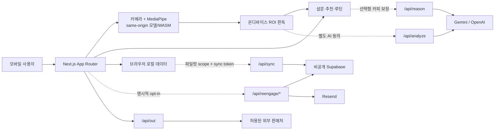

# 아루 ARU

ARU는 계정 없이 선택형 온디바이스 카메라 관찰과 짧은 설문을 결합해, 사용자의 선호·예산·사용 맥락에 맞는 K-뷰티 제품 후보와 일상 루틴을 제안하는 모바일 우선 웹앱입니다.

카메라를 사용하지 않아도 설문만으로 전체 추천 흐름을 완료할 수 있습니다. ARU의 카메라 결과는 현재 사진에서 보이는 미용적 경향을 설명하는 보조 정보이며, 의료 진단·치료·질환 모니터링이 아닙니다.

- Production: <https://aru-beauty.vercel.app>
- 제품 계약과 KPI: [docs/PRD.md](docs/PRD.md)
- 현재 검증 상태: [docs/STATUS.md](docs/STATUS.md)
- 시스템 구조: [docs/architecture.md](docs/architecture.md)
- 최신 다국어 제품 카피 QA: [docs/qa/2026-07-19-product-copy-polish.md](docs/qa/2026-07-19-product-copy-polish.md)
- 최신 Product polish·Production canary: [docs/qa/2026-07-19-product-polish-loop.md](docs/qa/2026-07-19-product-polish-loop.md)
- 이전 Production canary: [docs/qa/2026-07-19-release-completion-canary.md](docs/qa/2026-07-19-release-completion-canary.md)
- 출시 절차: [docs/production-release-checklist.md](docs/production-release-checklist.md)

## 현재 릴리스 상태

이 표는 코드 완료와 외부 오너 작업을 구분합니다. 최신 세부 상태의 단일 기준은 [STATUS](docs/STATUS.md)입니다.

| 영역 | 현재 상태 | 확인된 증거 | 다음 게이트 |
|---|---|---|---|
| 소비자 Web | Product polish Production 배포·canary 완료 | PR #55, merge `024784c`, deployment `dpl_FCKydr4QKpM5Zh28aGrkxev6Ad8U`, 전체 smoke와 post-deploy 모바일/API canary | 이후 코드·환경 변경 시 동일 gate 반복 |
| 보안·데이터 경계 | Production 검증 완료 | 9개 앱 테이블 RLS, `anon`/`authenticated` 직접 권한 거부, 비공개 crop bucket, CSP, Firewall, runtime secret 검증 | schema·secret 변경 시 운영 검증 반복 |
| 모바일 UI/UX | 4개 viewport·KO/EN/JA/ZH 카피 회귀 통과 | 9개 핵심 route × 4개 언어 × 4개 viewport, 총 144개 텍스트 핏 조합과 320px 수동 브라우저 QA 통과 | 새 화면·번역 추가 시 동일 매트릭스 확장 |
| Android 카메라 | Galaxy S25 Edge 기본 흐름 PASS | 권한, 전면 미러링, 품질 게이트, 촬영 완료, 재촬영 | 조도·반사·가림·background/resume와 iPhone Safari 매트릭스 |
| iPhone Safari 카메라 | WebKit lifecycle 회귀 PASS·실기기 PENDING | WebKit 26.5 iPhone 17 Pro profile에서 KO/EN/JA/ZH, background, `mute`, `ended`, `pagehide`, 명시적 재개 | 최신·이전 iOS Safari 물리 단말 권한·렌즈·회전·촬영 매트릭스 |
| 이메일 | 코드·정책 구현 완료 | 명시적 opt-in, 서명·만료 해지, 철회 제외, 보존 정리 테스트 | 검증 도메인으로 실제 수신·해지·cron 확인 |
| Android TWA | API 36 signed AAB 검증 완료 | package, 권한, 서명, lint `No issues found`, Gradle clean bundle, Digital Asset Links 검증 | Play distribution certificate 반영 후 internal track 실기기 QA |
| Google Play | 제출 패키지 준비, Console 작업 차단 | ko/en 등록정보, Data safety, 콘텐츠 등급, reviewer 문서, 실제 UI 자산 | 개발자 신원·결제 계정·지원 이메일·App Signing·테스터 트랙 |

> Web Production 배포 완료는 Google Play 출시 완료를 의미하지 않습니다. Play Console에서만 얻을 수 있는 신원, 결제, distribution certificate와 테스트 트랙 증거는 저장소에서 추측하지 않습니다.

## 제품이 해결하는 문제

K-뷰티 구매자는 많은 제품 수와 과장된 표현 때문에 자신에게 맞는 후보를 빠르게 좁히기 어렵습니다. ARU는 다음 원칙으로 이 문제를 줄입니다.

- 계정 생성 없이 모바일에서 바로 시작합니다.
- 카메라는 선택 사항이며, 실패하거나 거부해도 설문 흐름을 계속할 수 있습니다.
- 피부 사진 전체보다 T-zone과 양 볼의 피부 ROI 품질을 우선 확인합니다.
- 추천 후보는 최대 3개로 제한하고, 선택 근거와 아침·저녁 사용 루틴을 함께 보여줍니다.
- 판매처 이동과 실제 사용 시작을 다른 행동으로 기록합니다.
- 검증되지 않은 가격, 재고, 별점, 리뷰 수, 제휴 배지를 표시하지 않습니다.
- 진단·치료·개선 보장 표현을 차단하고 “현재 사진에서 보이는 경향”과 설문 응답만 설명합니다.

### 범위 밖

- 피부 질환 진단, 치료, 처방 또는 상태 모니터링
- 사진만으로 확정하는 피부 타입이나 정량 임상 수치
- 구매·효과를 증명하는 것처럼 보이는 퍼널 해석
- 동의 없는 얼굴/피부 이미지 업로드 또는 학습 데이터 보존
- 계정, 결제, 주문, 배송을 직접 처리하는 커머스
- 검증되지 않은 실시간 가격·재고·리뷰 집계

## 핵심 사용자 흐름

### 1. 카메라 여정

`홈 → 스캔 권한/선택 동의 → 피부 ROI 품질 게이트 → 자동 또는 수동 촬영 → 결과 확인/재촬영 → 설문 → 리포트 → 판매처·케어·공유 → 선택형 사용 시작/체크인`

1. 사용자가 `/scan`에 진입하면 카메라 목적과 저장·전송 선택을 먼저 확인합니다.
2. 전면 카메라의 얼굴 랜드마크로 T-zone과 양 볼의 피부 ROI를 정렬합니다.
3. 얼굴 크기·중앙 정렬·정면 각도·밝기·흔들림·피부 ROI 상태를 연속 품질 틱으로 평가합니다.
4. 자동 촬영은 2틱 연속 통과 후 카운트다운을 시작하며, 조건을 이탈하면 취소합니다.
5. 캡처 직후 원본 해상도로 다시 검증하고 추가 2프레임을 분석해 일시적 노이즈를 줄입니다.
6. 품질이 부족하면 이유와 조정 방법을 보여주고 재촬영 또는 설문 전용 진행을 제공합니다.
7. iPhone Safari에서 탭 전환이나 camera track 중단이 발생하면 기존 stream을 해제하고, 사용자가 명시적으로 카메라를 다시 켤 수 있는 복구 화면을 제공합니다.
8. AI 교차 검증과 학습용 crop은 서로 다른 명시적 동의를 받은 경우에만 실행합니다.

### 2. 설문 전용 여정

`홈 → 설문 → 리포트 → 판매처·케어·공유 → 선택형 사용 시작/체크인`

- 카메라 권한 거부, 지원하지 않는 브라우저, 모델 로딩 실패, 저조도 또는 사용자의 선택 모두 같은 설문 fallback으로 연결됩니다.
- 카메라 결과가 없으면 리포트는 스캔 근거를 만들지 않고 설문 답변만 사용합니다.
- AI provider key가 없거나 provider가 실패해도 로컬 추천과 템플릿 설명으로 완료됩니다.

### 3. 연구·파일럿 여정

`내부 파일럿 세션 → participant/session 일치 확인 → 목적별 동의 → 촬영·피드백 → 로컬 검토/내보내기 → 인증된 서버 동기화 → 오프라인 평가`

- `/pilot`, `/ops`, `/eval`은 Production에서 기본적으로 404입니다.
- 파일럿 scope는 participant와 session이 모두 정확히 일치해야 합니다.
- 일반 사용자 동의를 파일럿 동의로 간주하는 fallback은 없습니다.
- 모델 승격은 자동화하지 않으며 정해진 데이터·공정성 게이트를 사람이 검토합니다.

### 4. 리마인더 여정

`명시적 이메일 구독 → 2주/4주 cron → 체크인 → 서명된 해지 → 해지 또는 4주차 발송 후 30일 정리`

- 추천 사용을 시작한 사용자가 별도로 opt-in한 경우에만 이메일을 저장합니다.
- 해지 토큰은 서명·만료를 검증합니다.
- 철회된 연락처는 이후 발송 대상에서 제외합니다.
- 코드 테스트와 실제 Resend 수신 검증은 별도 출시 게이트입니다.

## 화면과 route 지도

| 경로 | 역할 | 실패·보호 동작 |
|---|---|---|
| `/` | 제품 소개, 언어 전환, 카메라/설문 시작 | 핵심 CTA는 360px에서 44px 터치 타깃 유지 |
| `/scan` | 카메라 품질 게이트, 캡처, 온디바이스 분석 | 권한·모델·품질 실패 시 재시도 또는 `/survey` |
| `/survey` | 피부 고민, 선호, 예산, 제외 조건 설문 | 세션 기준 조회·완료 이벤트를 분리 기록 |
| `/report` | 최대 3개 후보, 선택 이유, 신뢰 설명 | AI 실패 시 검증된 로컬 템플릿 사용 |
| `/care` | 아침·저녁 루틴, 사용 시작, 판매처 | 판매처 클릭과 사용 시작을 분리 |
| `/reco` | 추천 후보 비교·후속 탐색 | 검증되지 않은 가격·재고·리뷰 비표시 |
| `/studio` | 공유 카드 편집·Web Share | 실스캔 결과가 있으면 안전하게 prefill |
| `/checkin` | 사용 후 2·4주 체크인 | 로컬/구독 상태가 없으면 안전한 안내 |
| `/privacy` | 데이터 목적·전송·보존·삭제 설명 | Production 공개 URL로 사용 |
| `/unsubscribe` | 서명된 이메일 구독 해지 | 누락·변조·만료 토큰 거부 |
| `/pilot`, `/ops`, `/eval` | 연구 참가·운영·평가 도구 | 허용 환경이 아니면 Production 404 |

## 시스템 구조



기본 카메라 판독과 추천은 브라우저에서 동작합니다. 서버 API는 AI 교차 검증, 인증된 파일럿 동기화, 이메일 운영, 허용된 판매처 redirect에만 사용합니다. 상세 데이터 흐름과 ML 승격 구조는 [Architecture](docs/architecture.md)를 참고하세요.

## 카메라와 피부 ROI 파이프라인

ARU는 단순히 “얼굴이 보이는가”보다 “분석할 피부 영역의 품질이 충분한가”를 우선합니다.

1. `getUserMedia`로 1080×1440 전면 카메라를 우선 요청하고, 실패하면 720×960 profile로 재시도합니다.
2. 650ms 주기로 MediaPipe FaceLandmarker를 VIDEO 모드로 실행합니다.
3. 얼굴 크기, 중앙 정렬, 정면 각도와 함께 T-zone·양 볼 ROI를 계산합니다.
4. 너무 어둡거나 밝은 노출, 반사, 흔들림, ROI 가림과 유효 샘플 수를 확인합니다.
5. 자동 촬영은 2틱 연속 통과해야 3→2→1 카운트다운에 진입합니다.
6. 촬영 순간 원본 해상도 품질을 다시 확인합니다.
7. 140ms 간격의 추가 2프레임과 중앙값 합의로 일시적 흔들림·반사를 줄입니다.
8. T-zone 13점과 양 볼 14점의 작은 패치를 샘플링하고 휘도 상·하위 10%를 제외합니다.
9. shine, 부위 상대 redness, texture variation, 밝기, specular 신호를 버킷으로 변환합니다.
10. 속성 확신과 환경 신호를 결합해 confidence와 재촬영 필요 여부를 결정합니다.

카메라 orchestration은 한 페이지에 모든 책임을 두지 않도록 다음 단위로 분리되어 있습니다.

- `camera-stream.ts`: 권한과 MediaStream lifecycle
- `create-landmarker.ts`, `use-landmarker.ts`: 모델 생성·해제
- `camera-quality.ts`, `skin-roi-quality.ts`: 프레임·피부 ROI 품질 계약
- `use-quality-loop.ts`: 반복 품질 판정과 자동 촬영 상태
- `capture-analysis.ts`, `use-capture-analysis.ts`: 캡처 후 burst 분석
- `consent-authorization.ts`: 목적별 전송·저장 scope 확인
- `page.tsx`: 사용자 흐름과 화면 상태 조정

모델과 WASM은 `public/vendor/mediapipe/`에서 same-origin으로 제공되며 CDN 런타임 의존성이 없습니다. `postinstall`과 `npm run assets:mediapipe`가 패키지 자산을 복사하고, 테스트와 smoke가 누락·경로·응답을 검사합니다.

`npm run test:ios-safari`는 Playwright WebKit 26.5와 iPhone 17 Pro device profile에서 inline/muted/autoplay 계약, KO/EN/JA/ZH 복구 카피, background, `mute`, `ended`, `pagehide`, 명시적 재시작, overflow와 터치 타깃을 검사합니다. 이는 WebKit 엔진 회귀이며 실제 렌즈나 iOS 권한 UI를 재현하는 물리 단말 검증은 아닙니다.

실기기 카메라 변경은 [Mobile camera QA](docs/mobile-camera-qa.md)의 Android Chrome·iOS Safari 항목을 채워야 합니다. 자동 테스트는 실제 렌즈, OS 권한 UI, 열·메모리, background/resume 동작을 대체하지 않습니다.

## 데이터, 동의와 보존

| 데이터 | 기본 위치 | 목적 | 보존·삭제 | 전송 조건 |
|---|---|---|---|---|
| 현재 스캔·설문 상태 | 브라우저 세션/로컬 | 추천 흐름 복원 | 사용자가 전체 삭제 가능 | 기본 전송 없음 |
| 최근 결과·사용 시작·체크인 | `localStorage` | 재방문과 루틴 추적 | 등록된 기기 데이터 삭제 경로로 제거 | 기본 전송 없음 |
| 익명 퍼널 이벤트 | `localStorage` | 제품 퍼널 진단 | 최대 1,000개, 전체 삭제 포함 | 기본 전송 없음 |
| 학습용 피부 crop | 로컬 및 비공개 Storage | 동의한 파일럿 캘리브레이션 | 기본 180일, 만료·철회 시 삭제/제외 | `learning_crop` 동의 + 정확한 파일럿 scope |
| AI 분석용 피부 crop | 처리 메모리와 선택 provider | 선택형 교차 검증 | ARU가 영구 저장하지 않음 | `ai_analysis` 동의 |
| 이메일·동의·발송 메타데이터 | 비공개 Supabase | 2·4주 리마인더 | 4주차 발송 또는 해지 후 30일에 정리 대상 | 명시적 이메일 opt-in |

새 로컬 데이터 키는 반드시 [lib/device-data.ts](lib/device-data.ts)에 등록하고 전체 삭제 테스트에 포함합니다. 목적, 위치, 전송 조건, 보존 기간과 삭제 경로가 정해지기 전에는 새 데이터를 수집하지 않습니다.

## 보안·프라이버시 불변식

- Supabase 앱 테이블은 RLS를 켜고 `anon`/`authenticated`의 직접 `SELECT`, `INSERT`, `UPDATE`, `DELETE` 권한을 철회합니다.
- `SUPABASE_SERVICE_ROLE_KEY`, sync token, cron/unsubscribe secret, Resend key와 AI provider key는 서버에서만 사용합니다.
- 비밀 값에는 `NEXT_PUBLIC_` 접두사를 붙이지 않습니다.
- Supabase runtime은 유효한 HTTPS/loopback URL, service-role 형식, 32자 이상 sync token만 구성 완료로 인정하며 Vercel 마스킹 문자열은 거부합니다.
- `/api/analyze`, `/api/reason`, subscribe와 sync는 byte·schema·rate 경계를 먼저 통과해야 외부 작업을 시작합니다.
- 외부 AI provider 요청은 15초 timeout을 사용하고, 실패 시 안전한 오류 또는 로컬 템플릿으로 종료합니다.
- Vercel Firewall은 provider를 호출할 수 있는 POST 경로에 전역 제한을 두고, route별 limiter를 2차 방어로 유지합니다.
- CSP는 same-origin script, worker, media와 연결을 기본으로 강제합니다.
- `Permissions-Policy`는 카메라를 same-origin에만 허용하고 microphone, geolocation, payment, USB, interest-cohort 계열 기능을 허용하지 않습니다.
- 내부 `/pilot`, `/ops`, `/eval` 경로는 명시적 허용 환경이 아니면 404입니다.
- 카메라·저장소·네트워크 오류가 설문 추천 경로를 막지 않아야 합니다.
- 판매처 redirect는 SKU와 merchant 허용목록을 검증하며 임의 URL을 받지 않습니다.
- 추천 카피는 의료·효능 보장 표현 필터를 통과해야 합니다.

### 서버 API 경계

| API | 용도 | 주요 방어 | 안전한 실패 |
|---|---|---|---|
| `POST /api/analyze` | 동의한 피부 ROI의 선택형 vision 교차 검증 | 2,100,000 byte, JSON/schema, IP당 10회/60초, provider 15초 timeout | 400/413/429/502/503; 로컬 분석 유지 |
| `POST /api/reason` | 추천 이유 문구의 선택형 LLM 보정 | 32,768 byte, JSON/schema, IP당 10회/60초, provider 15초 timeout, 출력 claim filter | 검증된 템플릿 fallback |
| `GET/POST /api/sync` | 파일럿 상태 확인과 인증된 batch sync | sync token, origin allowlist, 5 MiB, 인증 후 IP당 12회/60초, consent/scope 검증 | 비인증·불허 origin·과대 body 거부 |
| `POST /api/reengage/subscribe` | 명시적 이메일 opt-in | email/schema/body 검증, IP당 5회/60초, private DB | 미구성 시 기능 비활성 또는 안전한 오류 |
| `POST /api/reengage/unsubscribe` | 서명된 해지 | token 서명·만료·상태 검증 | 변조·만료 token 거부 |
| `GET /api/reengage/run` | 2·4주 발송과 retention cleanup | cron secret, batch 50, 최대 45초, 철회 제외 | 인증 실패 거부, 제한 내 재실행 가능 |
| `GET /api/out` | 허용된 판매처 redirect와 클릭 기록 | SKU/merchant/placement allowlist, UTM 구성 | 잘못된 입력 거부 |

운영 설정과 실제 검증 방법은 [Supabase sync runbook](docs/supabase-sync-runbook.md)과 [Re-engagement setup](docs/reengage-setup.md)을 따릅니다.

## 제품 KPI 계약

모든 비율은 보고 기간의 고유 `sessionId` 교집합으로 계산하며 같은 세션의 중복 이벤트를 한 번으로 셉니다. 카메라 여정과 설문 전용 여정을 하나의 직선 퍼널로 억지로 합치지 않습니다.

| 지표 | 정의 | 목표 |
|---|---|---|
| 스캔 완료율 | 스캔 시작 세션 중 완료 세션 | ≥ 70% |
| 촬영 실패율 | 시작 후 3분 안에 완료하지 못한 세션 | ≤ 20% |
| 설문 완료율 | 설문 조회 세션 중 완료 세션 | ≥ 65% |
| 리포트 도달률 | 설문 완료 후 추천을 본 세션 | ≥ 95% |
| 재촬영 권고율 | 완료 스캔 중 `retake=true` 세션 | ≤ 25% |
| 추천 행동률 | 추천 조회 후 판매처를 연 세션 | ≥ 15% |
| 공유율 | 스캔 완료 후 공유한 세션 | 관찰 지표 |
| 2주 체크인율 | 2주 도래 구독자 중 체크인 완료 | ≥ 20% |

AI 전송·학습 동의율은 성장 최적화 대상이 아니라 안전 KPI입니다. `failurePreventionConversion` 같은 내부 진단 이름도 구매·효과·실패 방지를 증명하는 외부 표현으로 사용하지 않습니다.

## 기술 스택

| 영역 | 기술 | 선택 이유 |
|---|---|---|
| Web | Next.js 16.2.9 App Router, React 19.2.4, TypeScript | 모바일 Web/PWA와 서버 route를 한 저장소에서 운영 |
| UI | Tailwind CSS 4, CSS design tokens | 작은 화면과 다국어 상태를 일관되게 관리 |
| Vision | MediaPipe Tasks Vision 0.10.35 | 브라우저에서 얼굴 랜드마크와 ROI 계산 |
| 데이터 | Supabase JS 2.108.2, Postgres, private Storage | 서버 전용 운영 데이터와 파일럿 crop |
| 선택형 AI | Gemini 또는 OpenAI | 동의한 분석 교차 검증과 추천 문구 보정 |
| Email | Resend | 명시적 2·4주 리마인더 |
| Android | Bubblewrap 1.24.1로 생성된 TWA, Gradle 8.11.1, target/compile SDK 36 | 생성기는 릴리스 의존성에서 분리하고 검토된 Gradle wrapper로 AAB 빌드 |
| 품질 | Vitest 4.1.9, Playwright 1.61.1, ESLint 9 | 계약·보안·모바일 UI·production route 회귀 |

### 글꼴과 다국어

- 본문과 KO/EN/JA/ZH UI는 npm 패키지로 self-host하는 Pretendard Variable을 사용합니다.
- 짧은 한국어 브랜드 display에만 OFL-1.1의 Nanum Pen Script 5.2.7을 제한적으로 사용합니다.
- EN/JA/ZH 제목은 가독성을 위해 Pretendard로 자동 전환합니다.
- 런타임 폰트 CDN 요청은 없습니다.
- 지원 언어는 한국어, 영어, 일본어, 중국어 간체이며 번역 키 커버리지를 테스트합니다.

## 저장소 구조

```text
app/
├─ api/                       analyze, reason, sync, reengage, out route
├─ scan/                      카메라 stream·landmarker·품질·분석·UI orchestration
├─ survey/ report/ care/      핵심 추천 퍼널
├─ studio/ checkin/           공유와 사용 후 체크인
├─ privacy/ unsubscribe/      개인정보와 구독 해지
└─ pilot/ ops/ eval/          Production 기본 차단 연구 도구
lib/
├─ server/                    request guard, 입력 검증, 내부 접근, 해지 token
├─ i18n/                      KO 기본 + EN/JA/ZH 번역
├─ consent/crops/device-data  동의·보존·기기 데이터 계약
└─ recommend/commerce/funnel  추천·판매처·퍼널 도메인 로직
public/
├─ vendor/mediapipe/          self-hosted 모델·WASM·JS
├─ .well-known/assetlinks.json
└─ sw.js                      PWA cache와 offline fallback
android/                      com.seonkistall.aru Bubblewrap TWA
supabase/schema.sql           테이블·RLS·권한·Storage 기준
ml/                           오프라인 calibration/training/evaluation
scripts/                      smoke, asset, Android, Supabase 검증
tests/                        단위·계약·보안·모바일 브라우저 회귀
docs/                         PRD, 설계, QA 증거, 운영·Play runbook
```

코드를 변경하기 전 루트 [AGENTS.md](AGENTS.md)와 관련 제품·운영 문서를 확인하세요.

## 로컬 개발

### 필수 조건

- Node.js 20 이상과 npm
- Python 3 — smoke의 ML script compile 검사에 사용
- Git
- Chromium — 모바일 실브라우저 회귀에 사용

Android release 빌드에는 추가로 JDK 17, Android SDK/Build Tools와 서명 환경이 필요합니다. 기존 wrapper 빌드에는 Bubblewrap이 필요하지 않으며, wrapper 재생성은 별도 검토 작업입니다. 일반 Web 개발에는 Android toolchain이 필요하지 않습니다.

### 설치와 실행

```bash
git clone https://github.com/seonkistall/aru.git
cd aru
npm install
npx playwright install chromium
npm run dev
```

기본 주소는 <http://localhost:3000>입니다. 핵심 카메라 온디바이스 판독, 설문, 추천과 로컬 저장은 외부 key 없이 작동합니다. 선택형 AI 교차 검증, Supabase sync와 이메일 발송은 관련 서버 환경변수가 있을 때만 활성화됩니다.

### 주요 명령

| 명령 | 용도 |
|---|---|
| `npm run dev` | Next.js 개발 서버 |
| `npm test` | 전체 Vitest 계약·보안 회귀 |
| `npm run test:mobile-ui` | Playwright Chromium 모바일 기능·다국어·텍스트 핏 회귀 |
| `npm run test:ios-safari` | Playwright WebKit iPhone profile 카메라 lifecycle·다국어 복구 회귀 |
| `npm run lint` | ESLint |
| `npm run build` | Next.js Production build |
| `npm run smoke` | lint, unit, mobile browser, build, ML compile, 주요 route/auth 통합 검증 |
| `npm run supabase:check` | Production Supabase 권한·Storage 점검 |
| `npm run android:check` | TWA package/origin/API/권한/버전/toolchain/secret 점검 |
| `npm run assets:mediapipe` | MediaPipe same-origin 자산 복사 |
| `npm audit` | Production·개발 dependency 전체 취약점 점검 |
| `git diff --check` | whitespace·conflict marker 점검 |

## 서버 환경변수

환경별 값은 `.env` 파일에 커밋하지 말고 Vercel Production/Preview 또는 승인된 비밀 저장소에 등록합니다.

| 변수 | 필요 시점 | 공개 여부 | 설명 |
|---|---|---|---|
| `SUPABASE_URL` | sync/email | server-only | HTTPS Supabase project URL |
| `SUPABASE_SERVICE_ROLE_KEY` | sync/email | server-only | modern secret 또는 legacy service-role key |
| `SUPABASE_SYNC_TOKEN` | 파일럿 sync | server-only | 32자 이상 운영 token |
| `SUPABASE_CROP_BUCKET` | 파일럿 crop | server-only | 비공개 Storage bucket |
| `SUPABASE_CROP_RETENTION_DAYS` | 파일럿 crop | server-only | 기본 180일 보존 |
| `SUPABASE_SYNC_ALLOWED_ORIGINS` | 파일럿 sync | server-only | comma-separated origin allowlist |
| `RESEND_API_KEY` | 이메일 | server-only | 검증된 Resend 계정 key |
| `REENGAGE_FROM` | 이메일 | server-only | 검증 도메인의 발신 주소 |
| `REENGAGE_LINK_BASE` | 이메일 | server-only | Production 해지·체크인 base URL |
| `UNSUBSCRIBE_SECRET` | 이메일 | server-only | 서명·검증용 secret |
| `CRON_SECRET` | 이메일 cron | server-only | 발송 route 인증 |
| `GEMINI_API_KEY` | 선택형 vision | server-only | `/api/analyze` Gemini provider |
| `GEMINI_MODEL` | 선택형 vision | server-only | 미지정 시 `gemini-2.0-flash` |
| `OPENAI_API_KEY` | 선택형 vision/reason | server-only | OpenAI provider |
| `OPENAI_VISION_MODEL` | 선택형 vision | server-only | 미지정 시 `gpt-4o-mini` |
| `VISION_PROVIDER` | 선택형 vision | server-only | `gemini` 또는 `openai` |

정확한 생성·적용·검증 순서는 다음 문서를 사용합니다.

- [Production release checklist](docs/production-release-checklist.md)
- [Supabase sync runbook](docs/supabase-sync-runbook.md)
- [Re-engagement setup](docs/reengage-setup.md)

환경변수를 변경한 뒤에는 반드시 새 Production deployment를 만들고 `/api/sync`의 공개 상태 응답과 비인증/불허 origin 경계를 다시 확인합니다. 비밀 값 자체를 로그, issue, PR, screenshot 또는 채팅에 남기지 않습니다.

## 테스트와 품질 게이트

### 빠른 개발 루프

```bash
npm test
npm run lint
```

### 전체 Web smoke

```bash
npm run smoke
npm audit
git diff --check
```

`npm run smoke`는 현재 다음을 묶어서 검사합니다.

- ESLint와 TypeScript/Next.js Production build
- Vitest 58개 파일, 290개 테스트
- Playwright Chromium 모바일 E2E 41개
- Playwright WebKit 26.5 iPhone profile 카메라 lifecycle E2E 5개
- KO/EN/JA/ZH 홈과 핵심 callout
- 9개 핵심 route × KO/EN/JA/ZH × 320/360/393/768px, 총 144개 텍스트 핏 조합
- 카메라 권한 거부 fallback
- Studio, 리마인더, 개인정보 화면
- 잘린 문구, 깨진 문자, 다국어 키 누출, 가로 overflow와 44px 미만 핵심 터치 타깃
- MediaPipe model/WASM same-origin asset
- Production 공개 route와 내부 route 404
- API JSON/body/auth/origin 경계
- ML Python script compile

테스트 수는 기능 추가에 따라 증가할 수 있으므로 최신 실행 결과는 [STATUS](docs/STATUS.md)와 `docs/qa/`의 증거 문서를 우선합니다.

### 변경 유형별 추가 검증

| 변경 영역 | 최소 추가 검증 |
|---|---|
| 카메라·ROI | 관련 Vitest + `test:mobile-ui` + `test:ios-safari` + Android/iOS 실기기 매트릭스 |
| Supabase schema | `npm run supabase:check`, anon/auth 거부, service-role rollback, private bucket |
| 이메일 | subscribe/unsubscribe/retention 테스트 + 실제 수신 주소로 2·4주 dry-run |
| 보안 header/CSP | security tests + Chromium hydration/service worker/MediaPipe |
| 추천·커머스 | claim/product trust 테스트 + 허용 판매처 redirect |
| 제품 카피·번역 | copy contract + i18n coverage + 4개 locale/4개 viewport text-fit matrix |
| Android | `npm run android:check`, signed artifact 검증, TWA 실기기 |
| Play 자료 | `npm test -- tests/play-store-pack.test.ts`, Console 선언 대조 |

### 완료 정의

1. 실패 테스트 또는 재현 증거로 문제를 고정합니다.
2. 요청 범위의 최소 구현으로 대상 테스트를 통과시킵니다.
3. 전체 smoke, Production dependency audit와 `git diff --check`를 통과시킵니다.
4. 모바일 브라우저에서 핵심 흐름, console, network, overflow와 터치 타깃을 확인합니다.
5. merge 후 새 Production deployment에서 동일한 canary를 반복합니다.
6. 실제 단말·외부 provider·Console 항목은 별도 증거 없이 완료로 표시하지 않습니다.

## Web Production 배포

1. `main` 기준 clean install과 `npm run smoke`를 통과합니다.
2. Production Supabase에 [supabase/schema.sql](supabase/schema.sql)을 적용합니다.
3. 9개 앱 테이블 RLS와 `anon`/`authenticated` CRUD 거부를 재현합니다.
4. private crop bucket, service-role rollback과 retention 정책을 확인합니다.
5. Vercel Production secrets, allowed origin, provider 비용 한도와 Firewall rule을 확인합니다.
6. Resend 실제 수신, 서명 해지, 철회 제외와 30일 정리를 검증합니다.
7. Vercel에 Production 배포하고 canonical domain이 새 deployment를 가리키는지 확인합니다.
8. `/`, `/scan`, `/survey`, `/report`, `/privacy`, 주요 API와 MediaPipe asset canary를 실행합니다.
9. Vercel runtime error log, 브라우저 console/network와 모바일 렌더링을 확인합니다.
10. deployment ID, merge SHA, 테스트 결과와 남은 외부 게이트를 `docs/qa/`에 기록합니다.

2026-07-19 Product polish는 [PR #55](https://github.com/seonkistall/aru/pull/55), merge `024784c`와 Vercel Production deployment `dpl_FCKydr4QKpM5Zh28aGrkxev6Ad8U`로 배포되었습니다. 배포 뒤 16개 모바일 route case, KO/EN/JA/ZH, 이메일·카메라·redirect focused flow, CSP·RLS 연동 상태·API 인증 경계·MediaPipe asset을 다시 검사했고 실패와 최근 5xx/runtime error가 0건이었습니다. 정확한 명령·수치·남은 외부 게이트는 [검증 보고서](docs/qa/2026-07-19-product-polish-loop.md)에 기록합니다.

## Android TWA

`android/`는 `com.seonkistall.aru`가 `https://aru-beauty.vercel.app`만 여는, Bubblewrap으로 생성된 TWA 프로젝트입니다. 현재 릴리스는 체크인된 Gradle wrapper를 직접 빌드하며 Bubblewrap CLI를 npm 릴리스 그래프에 포함하지 않습니다.

| 항목 | 값 |
|---|---|
| package | `com.seonkistall.aru` |
| version | `1.1.0 (11000)` |
| Web origin | `https://aru-beauty.vercel.app` |
| min SDK | 23 |
| compile/target SDK | 36 |
| orientation | adaptive/any |
| Android 권한 | camera, storage, media, location, microphone, contacts, `AD_ID` 없음 |
| signing | ignored keystore + process environment only |
| 산출물 | ignored `app-release.aab`, `app-release.apk` |

```bash
npm run android:check
```

release keystore와 `.env.android.local`은 Git에서 제외합니다. 공개 upload certificate fingerprint만 `public/.well-known/assetlinks.json`과 `android/twa-manifest.json`에 동일하게 기록합니다.

Play App Signing을 활성화하면 Console이 제공하는 distribution certificate SHA-256을 기존 upload fingerprint와 함께 `assetlinks.json`에 추가하고 Web을 재배포해야 합니다. 그 뒤 Galaxy internal-track 설치에서 주소창이 사라지고 카메라·back·외부 링크·회전이 정상인지 다시 확인합니다.

재현 가능한 설정·빌드·검증은 [Android build runbook](docs/android-build-runbook.md), 최신 artifact hash와 서명 증거는 [Android artifact QA](docs/qa/2026-07-16-android-artifact.md)를 따릅니다.

## Google Play 제출

`docs/play-store/`에는 다음 제출 자료가 있습니다.

- ko-KR/en-US 앱 이름, short/full description
- Data safety 작업표
- 개인정보처리방침 검토표
- 콘텐츠 등급 답변 근거
- reviewer instructions
- 1.1.0 release notes
- internal testing checklist
- 512×512 앱 아이콘
- 1024×500 feature graphic
- 실제 설문 흐름의 1080×2160 phone screenshot 4장

```bash
npm test -- tests/play-store-pack.test.ts
node scripts/generate-play-assets.mjs
```

### Console 제출 전 외부 오너 게이트

- Play Console 개발자 신원 확인과 결제 계정 경고 해결
- 실제 개발자/법인명과 공개 지원 이메일 입력
- 업로드 키와 환경 파일의 암호화된 외부 백업
- Play App Signing distribution certificate를 Digital Asset Links에 반영
- AAB 업로드와 internal testing release 생성
- Galaxy S25 Edge internal-track TWA 실기기 QA
- pre-launch report, Data safety, 콘텐츠 등급과 개인정보처리방침 URL 확정
- 계정 유형·생성일 확인
- 해당되는 신규 개인 계정은 모바일 앱 기기 검증과 12명·14일 closed test 완료

상세 순서는 [Google Play internal test checklist](docs/play-store/internal-test-checklist.md)와 [Reviewer instructions](docs/play-store/reviewer-instructions.md)을 사용합니다.

## 이번 Production-readiness 과정

현재 README가 설명하는 기반은 다음 순서로 강화되었습니다.

1. Supabase RLS를 활성화하고 브라우저 `anon`/`authenticated` 직접 권한을 차단했습니다.
2. `/api/analyze`, `/api/reason`에 body 제한, schema 검증, per-IP 제한과 provider timeout을 추가했습니다.
3. 파일럿 participant/session scoped consent fallback을 제거하고 회귀 테스트로 고정했습니다.
4. Galaxy S25 Edge의 권한·미러링·품질 게이트·촬영·재촬영 기본 흐름을 확인했습니다.
5. MediaPipe model/WASM/JS를 same-origin으로 자체 제공하고 asset smoke를 추가했습니다.
6. 제품 범위, 의료 경계, 데이터 보존, KPI와 Web/TWA/Play 게이트를 단일 PRD로 통합했습니다.
7. `scan/page.tsx`의 stream, landmarker, quality loop, capture analysis와 consent 책임을 단계적으로 분리했습니다.
8. 명시적 이메일 opt-in, 서명·만료 해지, 철회 제외와 보존 정리를 구현했습니다.
9. enforced CSP, security header, Vercel Firewall과 Production Supabase runtime 검증을 추가했습니다.
10. 320px부터 768px까지 다국어 UI, 44px 터치 타깃, 카메라 fallback과 Studio/Privacy 흐름을 실제 Chromium 회귀로 고정했습니다.
11. API 36 Android TWA, release signing, Digital Asset Links, signed AAB/APK와 Play 제출 패키지를 준비했습니다.
12. 홈부터 체크인까지 소비자 카피를 정중하고 친근한 제품 언어로 다듬고, EN/JA/ZH를 각 언어의 어순과 서비스 관습에 맞춰 별도로 작성했습니다.
13. iPhone Safari의 background·`mute`·`ended`·`pagehide` camera lifecycle을 명시적 재개 흐름으로 보강하고 WebKit 26.5 다국어 회귀를 추가했습니다.

### 최근 release commit

| Commit | 변경 |
|---|---|
| `1d2738b` | Supabase runtime secret 형식과 마스킹 값 방어 |
| `ba9053f` | Android adaptive orientation |
| `83e7700` | returning-home 핵심 터치 타깃 복구 |
| `f0da693` | Play Console 계정 게이트 문서화 |
| `1e884e6` | 모바일 QA와 Play readiness gap 수정 |
| `3911282` | Production release completion canary 증거 기록 |
| `72de855`–`f4bce3e` | Product QA ISSUE-001~009 Web·copy·email 회귀 수정 |
| `eac5d16` | Android 생성기 격리, 전체 npm audit 0건, release lint 정리 |
| `024784c` | PR #55 Product polish 10개 이슈, 문서와 회귀 테스트의 Production merge |

전체 변경 이력과 PR 토론은 [GitHub repository](https://github.com/seonkistall/aru)에서 확인할 수 있습니다.

## 운영 문제 해결

### 카메라가 열리지 않음

- HTTPS 또는 loopback origin인지 확인합니다.
- 브라우저·OS 카메라 권한과 다른 앱의 카메라 점유를 확인합니다.
- `Permissions-Policy`가 `camera=(self)`인지 확인합니다.
- 사용자에게 설문 전용 fallback이 계속 보이는지 확인합니다.
- iPhone Safari에서 다른 탭이나 앱을 다녀온 뒤에는 `카메라 다시 켜기`를 눌러 새 stream을 시작합니다. 검은 preview를 그대로 분석하지 않습니다.

### 얼굴은 보이지만 품질 게이트가 통과하지 않음

- 정면의 부드러운 조명으로 이동하고 직접 반사와 역광을 피합니다.
- 렌즈를 닦고 T-zone과 양 볼이 머리카락·손·마스크에 가려지지 않게 합니다.
- 화면 안내 거리와 중앙 정렬을 맞춥니다.
- 통과 기준을 임의로 낮추기 전에 [Golden set](docs/golden-set.md)과 실기기 매트릭스로 회귀를 확인합니다.

### MediaPipe 로딩 실패

```bash
npm run assets:mediapipe
npm test -- tests/mediapipe-assets.test.ts
```

`public/vendor/mediapipe/`의 model/WASM/JS가 same-origin 200인지, CSP와 service worker cache가 해당 경로를 허용하는지 확인합니다.

### `/api/sync`가 `configured: false`

- `SUPABASE_URL`, `SUPABASE_SERVICE_ROLE_KEY`, 32자 이상 `SUPABASE_SYNC_TOKEN`, private bucket과 allowed origins를 확인합니다.
- Vercel 환경변수 변경 후 새 Production deployment를 생성합니다.
- 로그에 실제 secret을 출력하지 않습니다.
- [Supabase sync runbook](docs/supabase-sync-runbook.md)의 비인증·불허 origin·rollback 검증을 순서대로 실행합니다.

### 이메일이 발송되지 않음

- Resend domain verification과 `REENGAGE_FROM`의 domain 일치를 확인합니다.
- `RESEND_API_KEY`, `REENGAGE_LINK_BASE`, `UNSUBSCRIBE_SECRET`, `CRON_SECRET`의 Production scope를 확인합니다.
- 구독자가 명시적 opt-in 상태이며 철회·4주차 완료 대상이 아닌지 확인합니다.
- 실제 수신 주소, spam folder, Resend event와 Vercel runtime log를 함께 확인합니다.

### TWA에 주소창이 표시됨

- 설치된 build의 signing certificate가 upload key인지 Play distribution key인지 확인합니다.
- 해당 SHA-256이 Production `/.well-known/assetlinks.json`에 있는지 확인합니다.
- package name과 origin이 `com.seonkistall.aru`, `https://aru-beauty.vercel.app`로 정확히 일치하는지 확인합니다.
- Web 재배포와 앱 재설치 후 association을 다시 확인합니다.

## 문서 안내

### 제품·UX

- [PRD](docs/PRD.md) — 제품 약속, 사용자, 데이터, KPI, 출시 게이트
- [i18n PRD](docs/i18n-prd.md) — 다국어 제품 요구사항
- [i18n UX flow](docs/i18n-ux-flow.md) — 언어별 사용자 흐름
- [Consumer product copy design](docs/superpowers/specs/2026-07-19-product-copy-design.md) — 보이스, 화면별 카피, locale·text-fit 계약
- [Commerce partnership playbook](docs/commerce-partnership-playbook.md) — 판매처·파트너 운영 원칙

### 시스템·ML

- [Architecture](docs/architecture.md) — 브라우저, API, 데이터, ML 구조
- [Analysis performance roadmap](docs/analysis-performance-roadmap.md) — 분석 성능 개선 단계
- [ML camera upgrade plan](docs/ml-camera-upgrade-plan.md) — 카메라 모델 전환 기준
- [ML inference architecture](docs/ml-inference-architecture.md) — inference와 승격 구조
- [Pilot ML loop](docs/pilot-ml-loop.md) — 동의한 파일럿 수집·평가
- [Golden set](docs/golden-set.md) — 카메라 판독 회귀 프로토콜
- [iPhone Safari camera QA](docs/qa/2026-07-20-ios-safari-camera.md) — WebKit lifecycle 회귀와 남은 물리 단말 게이트
- [Worker offload](docs/worker-offload.md) — 브라우저 worker 분리 계획

### QA·운영

- [Status](docs/STATUS.md) — 증거 기반 현재 상태와 차단 조건
- [Production release checklist](docs/production-release-checklist.md) — Web Production 절차
- [Multilingual product copy QA](docs/qa/2026-07-19-product-copy-polish.md) — 4개 언어 카피와 144개 텍스트 핏 조합
- [Release completion canary](docs/qa/2026-07-19-release-completion-canary.md) — 최신 배포 검증
- [Post-deploy security](docs/qa/2026-07-17-post-deploy-security.md) — CSP·Firewall 검증
- [Supabase Production QA](docs/qa/2026-07-18-supabase-production.md) — RLS·role·bucket 증거
- [Mobile camera QA](docs/mobile-camera-qa.md) — Android/iOS 실기기 매트릭스
- [Supabase sync runbook](docs/supabase-sync-runbook.md) — RLS·sync·삭제 운영
- [Re-engagement setup](docs/reengage-setup.md) — Resend·해지·보존

### Android·Google Play

- [Android build runbook](docs/android-build-runbook.md) — TWA 서명 빌드·검증
- [Android artifact QA](docs/qa/2026-07-16-android-artifact.md) — AAB/APK hash·서명·권한 증거
- [Internal test checklist](docs/play-store/internal-test-checklist.md) — Console·테스트 트랙 게이트
- [Data safety](docs/play-store/data-safety.md) — Play 선언 작업표
- [Privacy policy review](docs/play-store/privacy-policy-review.md) — 공개 정책 대조
- [Reviewer instructions](docs/play-store/reviewer-instructions.md) — 검토자용 앱 사용 안내

## 라이선스와 기여

이 저장소는 현재 `private: true` 애플리케이션 패키지로 관리됩니다. 외부 재사용이나 배포 권한은 저장소 소유자의 정책을 확인하세요. 의존 자산의 라이선스는 각 패키지와 배포 산출물의 고지를 따릅니다.

변경 PR은 제품 경계, 동의·보존 계약, 모바일 fallback과 Production gate를 함께 고려해야 합니다. 테스트만 통과했다는 이유로 실기기, provider, Supabase, Resend 또는 Play Console 검증을 완료로 표시하지 않습니다.
