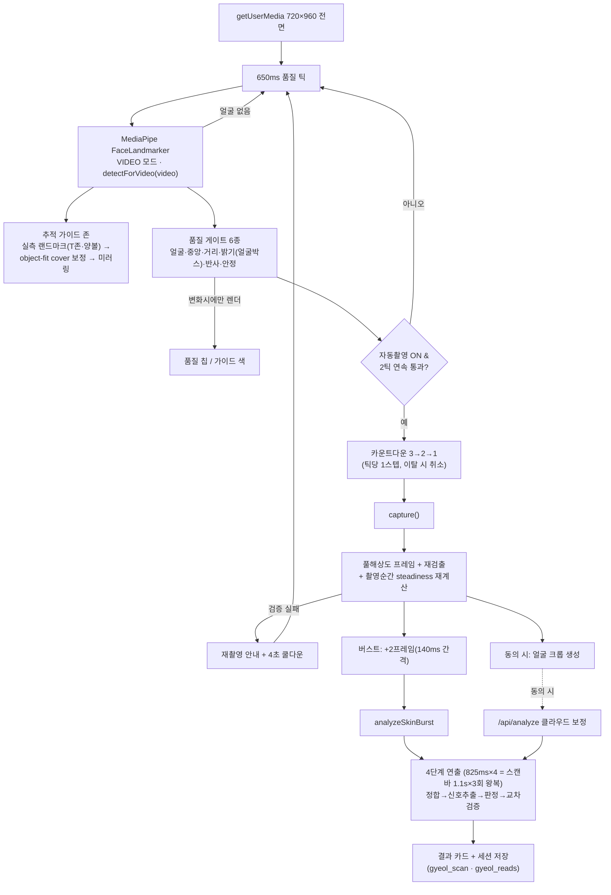
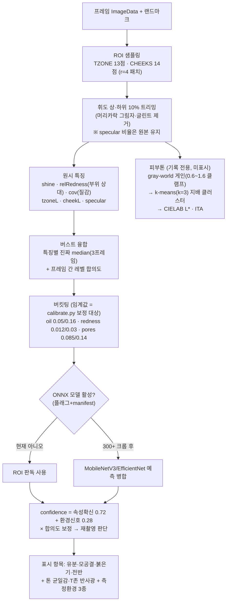
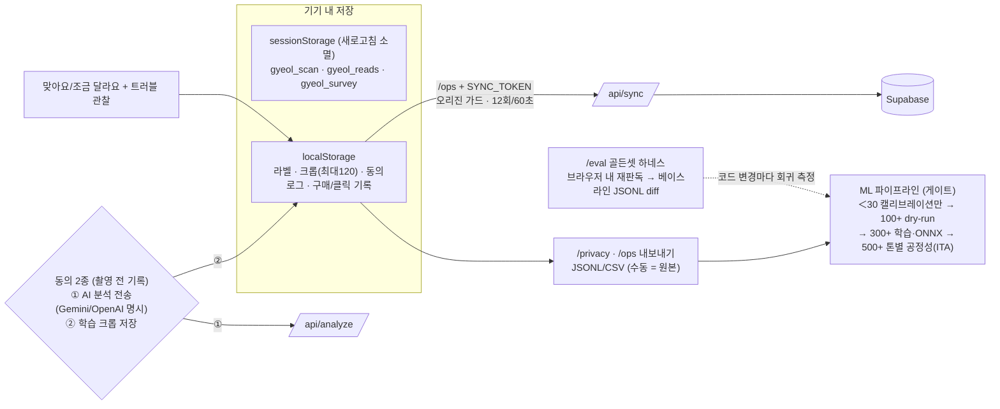
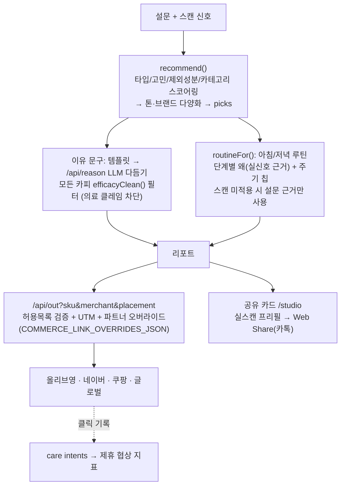

# 아루 ARU — 시스템 작동 원리 (파트별 도식)

> 코드 기준 문서 (2026-07-03, v0.4.3 / feature `roi-calibrated-2026-07-03`).
> 다이어그램은 GitHub에서 Mermaid로 렌더됩니다.

## 1. 전체 구성도

```mermaid
flowchart LR
    subgraph Client["📱 클라이언트 (Next.js 16 / 브라우저)"]
        HOME[홈 /] --> SCAN[촬영 /scan]
        SCAN --> SURVEY[설문 /survey]
        SURVEY --> REPORT[추천 /report]
        REPORT --> CARE[케어 /care]
        REPORT --> STUDIO[공유카드 /studio]
        SCAN -.연구모드.-> PILOT[/pilot 세션]
        PILOT -.-> OPS[/ops 대시보드]
        OPS -.-> EVAL[/eval 골든셋 하네스]
    end

    subgraph API["서버 라우트 (Vercel)"]
        ANALYZE["/api/analyze<br/>비전 교차검증"]
        REASON["/api/reason<br/>추천 카피 LLM"]
        OUT["/api/out<br/>커머스 클릭 추적"]
        SYNC["/api/sync<br/>파일럿 배치 업로드"]
    end

    subgraph Ext["외부"]
        GEM[Gemini / OpenAI]
        SB[(Supabase<br/>테이블+크롭 버킷)]
        SHOP[올리브영 · 네이버 · 쿠팡]
    end

    SCAN -- "동의 시 얼굴 크롭" --> ANALYZE --> GEM
    REPORT --> REASON --> GEM
    CARE & REPORT --> OUT -- "UTM + 허용목록 302" --> SHOP
    OPS -- "SYNC_TOKEN + 오리진 가드" --> SYNC --> SB

    subgraph ML["🧪 오프라인 ML (ml/, Python)"]
        CAL[calibrate.py<br/>임계값 보정] --> TRAIN["train_visible_attributes.py<br/>--arch mobilenetv3 | efficientnet_b0"]
        TRAIN --> ONNX[ONNX export] --> MANIFEST["manifest.json 승격<br/>+ NEXT_PUBLIC_VISIBLE_ATTR_MODEL"]
    end
    OPS -- "라벨/크롭 JSONL 내보내기" --> CAL
    MANIFEST -. "활성화되면 온디바이스 추론" .-> SCAN
```

**원칙:** 기본 분석은 전부 온디바이스. 서버·외부 전송은 동의(2종 분리) 뒤에만, 정량 피부 수치·효능 클레임은 어디에도 표시하지 않음.

## 2. 카메라 파이프라인 (촬영 → 판독)



## 3. 분석 엔진 (특징 → 판독)



## 4. 데이터 처리 & 동의 (수집 → 학습)



## 5. 추천 · 커머스 루프



## 관련 문서
`analysis-performance-roadmap.md`(성능 로드맵) · `pilot-ml-loop.md`(파일럿 런북) · `golden-set.md`(회귀 프로토콜) · `commerce-partnership-playbook.md`(BM) · `mobile-camera-qa.md`(QA)
