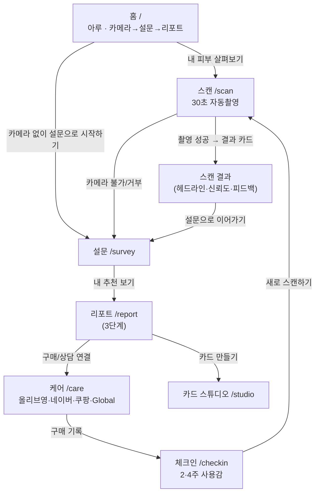
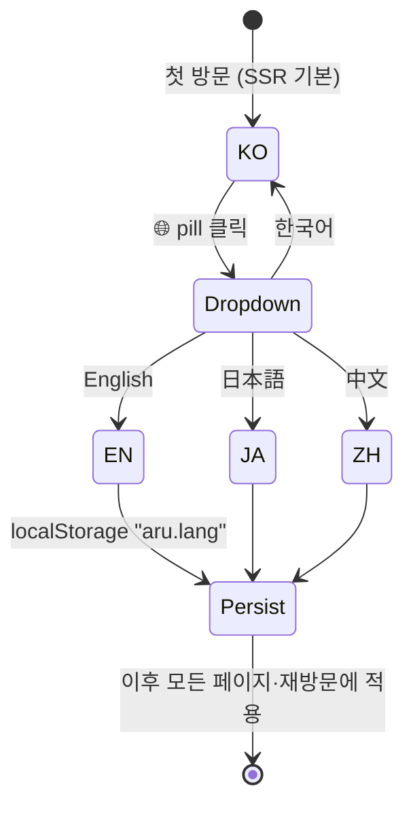
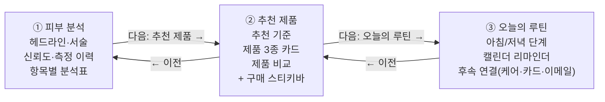

# UI/UX Flow — 아루 다국어 & 리포트 단계 플로우

- **버전**: v1.1 (PR #32 · #33)
- **관련**: [i18n-prd.md](i18n-prd.md) · [i18n-spec.md](i18n-spec.md)

---

## 1. 전체 유저 저니



- **언어 선택기는 모든 화면 우측 상단에 상시 고정** — 저니 어느 지점에서든 전환 가능
- 전환 시 현재 화면·입력 상태 기준으로 즉시 리렌더 (페이지 이동 없음)

## 2. 언어 선택 플로우



### 인터랙션 상세
| 단계 | 동작 | 화면 반응 |
|---|---|---|
| 1 | 우측 상단 `🌐 한국어` pill 클릭 | 드롭다운 오픈 (한국어/English/日本語/中文, 현재 언어 주황 강조) |
| 2 | 언어 선택 | 드롭다운 닫힘 → **전체 화면 즉시 전환** (손글씨 주석, 제품명, 버튼까지) |
| 3 | 외부 클릭 | 드롭다운 닫힘 (선택 없음) |
| 4 | 페이지 이동/재방문 | 선택 언어 유지. SSR 첫 페인트는 한국어 → 클라이언트에서 저장 언어로 1회 전환 |

### 실패·엣지 케이스
- 프라이빗 모드(스토리지 불가): 세션 내 메모리로 유지, 재방문 시 한국어 리셋
- 미번역 문자열: 한국어 폴백 (레이아웃 유지)
- 언어 A로 저장한 스캔/설문 → 언어 B로 열람: **B로 표시** (v1.1에서 보장)

## 3. 홈 화면 (언어별)

```
┌─────────────────────────────────────────────┐
│ 아루            아름다움을, 매일의 루틴으로   [🌐 한국어] │ ← 고정 스위처
│                                             │
│  (나에게 맞는 화장품 찾기, 30초면 충분해요.) ● │
│                                             │
│             오늘의 내 피부,                    │
│        어떤 스킨케어가 좋을까요?                │
│  AI 카메라로 제품과 루틴을 함께 찾아봐요.        │
│                                             │
│        카메라 → 설문 → 리포트                  │
│         이렇게 진행돼요                       │
│  ① 30초면 충분해요      ② 취향을 알려주세요     │
│  ③ 제품과 루틴을 함께 확인해요                 │
│                                             │
│          [ 내 피부 살펴보기 → ]                │
│       카메라 없이 설문으로 시작하기             │
└─────────────────────────────────────────────┘
```

EN 예: `What skincare suits / your skin today?` · 주석 `Find skincare that fits you, / in just 30 seconds.` · CTA `Start my skin check`
— 손글씨 폰트 톤 유지, 헤더는 스위처와 겹치지 않게 우측 패딩 확보.

## 4. 설문 화면 (v1.1 변경)

```
JUST A FEW MORE THINGS
ARU | Scan → [Survey] → Picks → Care
Let's fine-tune your picks
Required 0/3                    Please pick product, type & budget
─────────────────────────────────────────────
Product type *   [Cleanser][Toner][Essence][Serum]
                 [Cream][Sunscreen][Sheet mask][Eye cream]
Skin type *      [Oily][Dry][Combination][Sensitive][Normal]
Concerns         [Pores][Blackheads][Redness]… (다중 선택)
Budget *         [1만원][2만원][3만원][4만원][5만원 이상]   ← 5개로 확대
Ingredients to avoid  [Fragrance][Alcohol]…               ← 화해 힌트 삭제
─────────────────────────────────────────────
              [ See my picks ]  (3개 필수 채워지면 활성)
```

변경점:
1. 예산 4→**5개 선택지** (1/2/3/4만원 · 5만원 이상) — 라벨은 언어별 통화 표기(₩10,000 / 1万ウォン / 1万韩元)
2. "피하고 싶은 성분" 밑 **화해 주의 성분 기준 힌트 제거**

## 5. 리포트 — 3단계 플로우 (v1.1 핵심 변경)

### Before (v1.0): 한 화면 스크롤
`헤드라인 → 피부 분석 → 추천 기준 → 오늘의 루틴 → 후속 연결 → 추천 제품 → 비교` 를
전부 세로로 나열 → 정보 과밀, 핵심(추천 제품)이 최하단.

### After (v1.1): 단계별 화면



```
┌─────────────────────────────────────────────┐
│ 피부 리포트                          [🌐 한국어] │
│ 아루 | 촬영 → 설문 → [추천] → 케어              │
│ T존 유분이 도드라져 보여요        ●(캐릭터)      │
│ ┌───────────┬───────────┬───────────┐       │
│ │1. 피부 분석 │2. 추천 제품 │3. 오늘의 루틴│  ← 탭 (자유 이동)
│ └───────────┴───────────┴───────────┘       │
│                                             │
│   (현재 단계 콘텐츠만 표시)                    │
│                                             │
│  [← 이전]              [다음: 오늘의 루틴 →]   │
├─────────────────────────────────────────────┤
│ [올리브영 보기]   [구매/상담 연결]  ← 스티키바   │  ※ ②추천 단계에서만
└─────────────────────────────────────────────┘
```

### 단계 규칙
- **분기**: 스캔 데이터 있음 → 3단계(①②③) / 설문만 → 2단계(②③, 분석 생략)
- **헤드라인**: 첫 단계 = 스캔 헤드라인(예: "T존 유분이 도드라져 보여요"), 이후 단계 = 단계명
- **탭**: 순서 강제 없음, 클릭 즉시 이동 (활성=잉크 테두리+볼드, 완료=소프트 톤)
- **단계 전환 시 스크롤 최상단 리셋**
- **구매 스티키바**(1순위 제품 구매 + 구매/상담 연결): ② 추천 단계에서만 노출 — 분석·루틴을 읽는 동안 상업 요소가 시야를 차지하지 않음

## 6. 스캔 화면 언어 처리

```
[가이드 준비 중…] → [얼굴을 가이드에 맞춰주세요] → 실시간 피드백 → [자동 촬영 3·2·1] → 분석 4단계 → 결과 카드
```

- 실시간 피드백 문구 전부 번역: 거리·밝기·반사·흔들림 ("너무 가까워요…" → "Too close. Please step back a little.")
- 자동촬영 카운트다운: `자동 촬영 {n}` 보간 키로 언어별 표기
- 분석 진행 4단계 라벨 (촬영 프레임 정합 → 신호 추출 → 판정 → 교차 검증) 번역
- 결과 카드: 헤드라인·서술(narrative)은 **레벨 기반 재조립**으로 현재 언어 표시 — 과거 스캔도 현재 언어로 열림
- 촬영 옵션(자동 촬영/AI 분석 전송/학습 crop 저장)과 동의 안내 시트 번역 — 동의 감사 기록은 한국어 원문 보존

## 7. 케어 · 체크인 · 스튜디오

- **케어**: 구매처 라벨(Olive Young/NAVER Shopping/Coupang/Global search)·설명·피부과 연결·외국인 사용자 안내 번역. "Global search" 카드가 외국인 테스터의 해외 구매 확인 진입점
- **체크인**: 저장된 구매 제품명도 렌더 시 번역 (레드 블레미쉬 수분 크림 → レッドブレミッシュ水分クリーム). 2·4주차 배지, 만족도/트러블/재구매 응답 칩 번역
- **스튜디오**: 스캔 결과 프리필이 현재 언어로 채워짐. 사용자가 직접 수정한 텍스트는 그대로 존중

## 8. 상태·엣지 화면

| 화면 | 처리 |
|---|---|
| 에러/글로벌 에러 | "앗, 잠깐 멈췄어요" + 다시 시도/처음으로 — 번역 |
| 404 | "여긴 아무것도 없어요" — 번역 |
| 리포트 직행(데이터 없음) | /survey로 리다이렉트 |
| 공유 링크 유입 | "친구가 피부 무드를 공유했어요 → 나도 30초 스캔하기" 배너 번역 (바이럴 루프 유지) |

## 9. 디자인 원칙 (다국어 관점)

1. **손글씨 톤 유지** — 헤드라인·주석의 hand-drawn 보이스는 언어가 바뀌어도 동일 폰트 체계로 유지
2. **길이 탄력성** — EN/JA가 한국어보다 30~60% 길어짐: `keep-all + break-word + min-width:0` 전역 규칙, 탭은 ellipsis, 고정폭 카드는 다중행 허용
3. **숫자·통화 일관성** — 가격은 항상 KRW 기준(₩/万ウォン/万韩元), 리뷰 수는 `{n}만 → {n}0k/{n}万` 로케일 관용 표기
4. **상업 요소 단계 격리** — 구매 CTA는 추천 단계에만: 분석 신뢰 → 추천 수용 → 구매 전환의 심리 순서 보존
